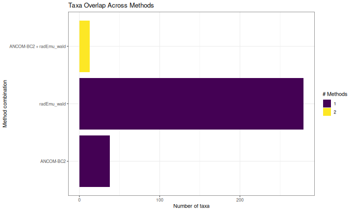
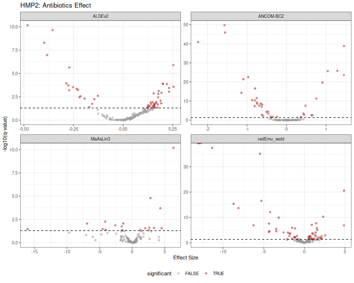

# Benchmarking Differential Abundance Methods

## Introduction

This vignette provides a comprehensive benchmark of differential
abundance (DA) methods for microbiome data, inspired by the
[benchdamic](https://bioconductor.org/packages/benchdamic/) package
approach. We compare seven methods:

| Method | Package | Approach |
|----|----|----|
| **ALDEx2** | ALDEx2 | CLR transformation + Monte Carlo sampling from Dirichlet |
| **ANCOM-BC2** | ANCOMBC | Linear regression with bias correction |
| **MaAsLin3** | maaslin3 | Generalized linear models (abundance + prevalence) |
| **DESeq2** | DESeq2 | Negative binomial GLM with size factor normalization |
| **edgeR** | edgeR | Negative binomial GLM with TMM normalization |
| **limma-voom** | limma | Linear models on voom-transformed counts |
| **radEmu** | radEmu | Robust estimation for relative abundance data |

The benchmark evaluates:

1.  **Method concordance**: Agreement between methods on significant
    taxa
2.  **Effect size correlation**: Consistency of effect size estimates
3.  **Sensitivity/Specificity trade-off**: Using simulated spike-in data
4.  **Computational considerations**: Runtime and ease of use

## Setup

``` r

library(comparpq)
library(phyloseq)
library(ggplot2)
library(dplyr)
library(tidyr)
library(tibble)
library(patchwork)

# For DA methods
library(DESeq2)
library(edgeR)
library(limma)
library(radEmu)
library(ALDEx2)
library(BiocParallel)
```

## Helper Functions

We define wrapper functions to standardize output across methods.

``` r

#' Run DESeq2 on phyloseq object
#' @param physeq A phyloseq object
#' @param formula Formula for the design (e.g., "~ condition")
#' @param contrast Character vector for contrast (e.g., c("condition", "B", "A"))
#' @param nclusters Number of cores for parallel processing (default 1)
#' @return Data frame with taxon, effect (log2FC), pvalue, qvalue
run_deseq2 <- function(physeq, formula, contrast, nclusters = 1) {
  # Convert to DESeq2
  dds <- phyloseq_to_deseq2(physeq, as.formula(formula))

  # Set up parallel processing
  if (nclusters > 1) {
    BPPARAM <- BiocParallel::MulticoreParam(workers = nclusters)
  } else {
    BPPARAM <- BiocParallel::SerialParam()
  }

  # Run DESeq2 with geometric mean estimation that handles zeros
  dds <- DESeq2::estimateSizeFactors(dds, type = "poscounts")
  dds <- DESeq2::estimateDispersions(dds, fitType = "local")
  dds <- DESeq2::nbinomWaldTest(dds)

  # Get results
  res <- DESeq2::results(dds, contrast = contrast, parallel = nclusters > 1, BPPARAM = BPPARAM)

  data.frame(
    taxon = rownames(res),
    effect = res$log2FoldChange,
    pvalue = res$pvalue,
    qvalue = res$padj,
    method = "DESeq2",
    stringsAsFactors = FALSE
  ) |>
    filter(!is.na(effect))
}

#' Run edgeR on phyloseq object
#' @param physeq A phyloseq object
#' @param group_var Name of grouping variable in sample_data
#' @param contrast_levels Two-element vector: c(treatment, reference)
#' @return Data frame with taxon, effect (logFC), pvalue, qvalue
run_edgeR <- function(physeq, group_var, contrast_levels) {
  # Extract data
  counts <- as(otu_table(physeq), "matrix")
  if (!taxa_are_rows(physeq)) counts <- t(counts)

  group <- factor(sample_data(physeq)[[group_var]])
  group <- relevel(group, ref = contrast_levels[2])

  # Create DGEList
  dge <- edgeR::DGEList(counts = counts, group = group)

  # Filter low counts
  keep <- edgeR::filterByExpr(dge)
  dge <- dge[keep, , keep.lib.sizes = FALSE]

  # Normalize
  dge <- edgeR::calcNormFactors(dge, method = "TMM")

  # Design matrix
  design <- model.matrix(~ group)

 # Estimate dispersion
  dge <- edgeR::estimateDisp(dge, design)

  # Fit model
  fit <- edgeR::glmQLFit(dge, design)
  qlf <- edgeR::glmQLFTest(fit, coef = 2)

  # Get results
  res <- edgeR::topTags(qlf, n = Inf)$table

  data.frame(
    taxon = rownames(res),
    effect = res$logFC,
    pvalue = res$PValue,
    qvalue = res$FDR,
    method = "edgeR",
    stringsAsFactors = FALSE
  )
}

#' Run limma-voom on phyloseq object
#' @param physeq A phyloseq object
#' @param group_var Name of grouping variable in sample_data
#' @param contrast_levels Two-element vector: c(treatment, reference)
#' @return Data frame with taxon, effect (logFC), pvalue, qvalue
run_limma_voom <- function(physeq, group_var, contrast_levels) {
  # Extract data
  counts <- as(otu_table(physeq), "matrix")
  if (!taxa_are_rows(physeq)) counts <- t(counts)

  group <- factor(sample_data(physeq)[[group_var]])
  group <- relevel(group, ref = contrast_levels[2])

  # Create DGEList for normalization
  dge <- edgeR::DGEList(counts = counts, group = group)

  # Filter low counts
  keep <- edgeR::filterByExpr(dge)
  dge <- dge[keep, , keep.lib.sizes = FALSE]

  # Normalize
  dge <- edgeR::calcNormFactors(dge, method = "TMM")

  # Design matrix
  design <- model.matrix(~ group)

  # Voom transformation
  v <- limma::voom(dge, design, plot = FALSE)

  # Fit linear model
  fit <- limma::lmFit(v, design)
  fit <- limma::eBayes(fit)

  # Get results
  res <- limma::topTable(fit, coef = 2, number = Inf, sort.by = "none")

  data.frame(
    taxon = rownames(res),
    effect = res$logFC,
    pvalue = res$P.Value,
    qvalue = res$adj.P.Val,
    method = "limma-voom",
    stringsAsFactors = FALSE
  )
}

#' Run ALDEx2 on phyloseq object
#' @param physeq A phyloseq object
#' @param group_var Name of grouping variable in sample_data
#' @param contrast_levels Two-element vector: c(treatment, reference)
#' @param nclusters Number of cores for parallel processing (default 1)
#' @return Data frame with taxon, effect, pvalue, qvalue
run_aldex2 <- function(physeq, group_var, contrast_levels, nclusters = 1) {

  # Convert factor to character to avoid ALDEx2 error
  sample_data(physeq)[[group_var]] <- as.character(sample_data(physeq)[[group_var]])

  # Extract counts and conditions for direct ALDEx2 call
  counts <- as(otu_table(physeq), "matrix")
  if (!taxa_are_rows(physeq)) counts <- t(counts)

  conds <- sample_data(physeq)[[group_var]]

  # Run ALDEx2 with parallel support
  clr <- ALDEx2::aldex.clr(
    counts,
    conds,
    mc.samples = 128,
    useMC = nclusters > 1
  )
  tt <- ALDEx2::aldex.ttest(clr)
  effect <- ALDEx2::aldex.effect(clr, useMC = nclusters > 1)
  res <- cbind(tt, effect)

  data.frame(
    taxon = rownames(res),
    effect = res$effect,
    pvalue = res$wi.ep,
    qvalue = res$wi.eBH,
    method = "ALDEx2",
    stringsAsFactors = FALSE
  )
}

#' Run ANCOM-BC2 on phyloseq object
#' @param physeq A phyloseq object
#' @param group_var Name of grouping variable in sample_data
#' @param contrast_levels Two-element vector: c(treatment, reference)
#' @param nclusters Number of cores for parallel processing (default 1)
#' @return Data frame with taxon, effect (lfc), pvalue, qvalue
run_ancombc <- function(physeq, group_var, contrast_levels, nclusters = 1) {
  res <- MiscMetabar::ancombc_pq(
    physeq,
    fact = group_var,
    levels_fact = contrast_levels,
    tax_level = NULL,
    n_cl = nclusters
  )

  # Find the correct column names (depends on factor levels)
  lfc_col <- grep("^lfc_", colnames(res$res), value = TRUE)[1]
  p_col <- grep("^p_", colnames(res$res), value = TRUE)[1]
  q_col <- grep("^q_", colnames(res$res), value = TRUE)[1]

  data.frame(
    taxon = res$res$taxon,
    effect = res$res[[lfc_col]],
    pvalue = res$res[[p_col]],
    qvalue = res$res[[q_col]],
    method = "ANCOM-BC2",
    stringsAsFactors = FALSE
  ) |>
    filter(!is.na(effect))
}

#' Run MaAsLin3 on phyloseq object
#' @param physeq A phyloseq object
#' @param group_var Name of grouping variable in sample_data
#' @param contrast_levels Two-element vector: c(treatment, reference)
#' @param nclusters Number of cores for parallel processing (default 1)
#' @return Data frame with taxon, effect (coef), pvalue, qvalue
run_maaslin3 <- function(physeq, group_var, contrast_levels, nclusters = 1) {
  res <- maaslin3_pq(
    physeq,
    formula = paste0("~ ", group_var),
    reference = setNames(list(contrast_levels[2]), group_var),
    output = tempfile(),
    correction_for_sample_size = TRUE,
    plot_summary_plot = FALSE,
    plot_associations = FALSE,
    cores = nclusters
  )

  df <- res$fit_data_abundance$results |>
    filter(grepl(group_var, metadata))

  data.frame(
    taxon = df$feature,
    effect = df$coef,
    pvalue = df$pval_individual,
    qvalue = df$qval_individual,
    method = "MaAsLin3",
    stringsAsFactors = FALSE
  ) |>
    filter(!is.na(effect))
}

#' Run radEmu on phyloseq object
#' @param physeq A phyloseq object
#' @param group_var Name of grouping variable in sample_data
#' @param contrast_levels Two-element vector: c(treatment, reference)
#' @param return_wald_p If TRUE (default), use fast Wald p-values. If FALSE,
#'   use slower but more robust score tests with two-step filtering.
#' @param effect_threshold Minimum absolute effect to test with score tests
#'   (only used when return_wald_p = FALSE, default 0.5)
#' @param max_taxa_to_test Maximum number of taxa to test with score tests
#'   (only used when return_wald_p = FALSE, default NULL = all)
#' @param nclusters Number of cores for parallel processing (default 1)
#' @param ... Additional arguments passed to `radEmu::emuFit()`
#' @return Data frame with taxon, effect (estimate), pvalue, qvalue
run_emuFit <- function(physeq, 
group_var, 
contrast_levels,
                       return_wald_p = TRUE,
                       effect_threshold = 0.5,
                        max_taxa_to_test = NULL,
                       nclusters = 1, ...) {
  # Remove samples with zero total counts (radEmu requirement)
  sample_totals <- sample_sums(physeq)
  physeq <- prune_samples(sample_totals > 0, physeq)

  # Relevel factor so reference is first
  sample_data(physeq)[[group_var]] <- factor(
    sample_data(physeq)[[group_var]],
    levels = c(contrast_levels[2], contrast_levels[1])
  )

  if (return_wald_p) {
    # Fast approach: single fit with Wald p-values
    fit <- radEmu::emuFit(
      formula = as.formula(paste0("~ ", group_var)),
      Y = physeq,
      run_score_tests = FALSE,
      return_wald_p=return_wald_p,
      ...
    )

    # Extract results (Wald p-values are in pval column)
    coef_df <- fit$coef |>
      filter(covariate != "(Intercept)")

    # Adjust p-values for multiple testing
    coef_df$wald_q <- p.adjust(coef_df$wald_p, method = "BH")

    return(data.frame(
      taxon = coef_df$category,
      effect = coef_df$estimate,
      pvalue = coef_df$wald_p,
      qvalue = coef_df$wald_q,
      method = "radEmu_wald",
      stringsAsFactors = FALSE
    ) |>
      filter(!is.na(effect)))
  }

 # Two-step approach with score tests (slower but more robust)

  # Step 1: Run emuFit WITHOUT testing (fast) to get effect estimates
  fit_effects <- radEmu::emuFit(
    formula = as.formula(paste0("~ ", group_var)),
    Y = physeq,
    run_score_tests = FALSE,
    ...
  )

  # Extract effect estimates
  coef_df <- fit_effects$coef
  coef_df$abs_effect <- abs(coef_df$estimate)

  # Step 2: Select taxa with high effects to test
  # Filter by threshold and optionally limit to max_taxa_to_test
  taxa_to_test <- coef_df |>
    filter(covariate != "(Intercept)", abs_effect >= effect_threshold) |>
    arrange(desc(abs_effect))

  if (!is.null(max_taxa_to_test) && max_taxa_to_test > 0) {
    taxa_to_test <- head(taxa_to_test, max_taxa_to_test)
  }

  if (nrow(taxa_to_test) == 0) {
    # No taxa meet threshold - return all with NA p-values
    return(data.frame(
      taxon = coef_df$category[coef_df$covariate != "(Intercept)"],
      effect = coef_df$estimate[coef_df$covariate != "(Intercept)"],
      pvalue = NA_real_,
      qvalue = NA_real_,
      method = "radEmu",
      stringsAsFactors = FALSE
    ))
  }

  # Get indices of taxa to test (j values)
  taxa_names_vec <- taxa_names(physeq)
  j_to_test <- match(taxa_to_test$category, taxa_names_vec)

  # Step 3: Run emuFit WITH score testing only for selected taxa
  fit_tested <- radEmu::emuFit(
    formula = as.formula(paste0("~ ", group_var)),
    Y = physeq,
    test_kj = data.frame(k = 2, j = j_to_test),
    parallel = nclusters > 1,
    ncores = nclusters
  )

  # Extract tested results
  tested_res <- fit_tested$coef |>
    filter(covariate != "(Intercept)")

  # Merge with all effects
  all_effects <- coef_df |>
    filter(covariate != "(Intercept)") |>
    dplyr::select(category, estimate)

  res <- all_effects |>
    left_join(
      tested_res |> dplyr::select(category, pval),
      by = "category"
    )

  # Adjust p-values for multiple testing (only for tested taxa)
  res$qvalue <- p.adjust(res$pval, method = "BH")

  data.frame(
    taxon = res$category,
    effect = res$estimate,
    pvalue = res$pval,
    qvalue = res$qvalue,
    method = "radEmu_score",
    stringsAsFactors = FALSE
  ) |>
    filter(!is.na(effect))
}

#' Run all DA methods on a phyloseq object
#' @param physeq A phyloseq object
#' @param group_var Name of grouping variable
#' @param contrast_levels Two-element vector: c(treatment, reference)
#' @param methods Character vector of methods to run
#' @param effect_threshold Minimum effect for radEmu testing (default 2)
#' @param nclusters Number of cores for parallel processing (default 2)
#' @param verbose If TRUE, print method name and elapsed time (default FALSE)
#' @param max_taxa_to_test Maximum number of taxa to test for radEmu (default NULL)
#'   see `run_emuFit()`
#' @return Combined data frame of results
run_all_methods <- function(physeq, group_var, contrast_levels,
                            methods = c("DESeq2", "edgeR", "limma-voom",
                                       "ALDEx2", "ANCOM-BC2", "MaAsLin3", "radEmu"),
                            effect_threshold = 2,
                            nclusters = 2,
                            verbose = TRUE, 
                            max_taxa_to_test=0,
                            return_wald_p = TRUE) {
  results <- list()
  timings <- list()

  for (method in methods) {
    if (verbose) {
       cli::cli_alert(cli::col_red("Running", method, "..."))
    }

    start_time <- Sys.time()

    res <- tryCatch({
      switch(method,
        "DESeq2" = run_deseq2(physeq,
                             paste0("~ ", group_var),
                             c(group_var, contrast_levels[1], contrast_levels[2]),
                             nclusters = nclusters),
        "edgeR" = run_edgeR(physeq, group_var, contrast_levels),
        "limma-voom" = run_limma_voom(physeq, group_var, contrast_levels),
        "ALDEx2" = run_aldex2(physeq, group_var, contrast_levels,
                             nclusters = nclusters),
        "ANCOM-BC2" = run_ancombc(physeq, group_var, contrast_levels,
                                  nclusters = nclusters),
        "MaAsLin3" = run_maaslin3(physeq, group_var, contrast_levels,
                                  nclusters = nclusters),
        "radEmu" = run_emuFit(physeq, group_var, contrast_levels,
                              return_wald_p = return_wald_p,
                              effect_threshold = effect_threshold,
                              nclusters = nclusters,
                              max_taxa_to_test=max_taxa_to_test                              )
      )
    }, error = function(e) {
      warning("Error in ", method, ": ", e$message)
      NULL
    })

    elapsed <- as.numeric(difftime(Sys.time(), start_time, units = "secs"))
    timings[[method]] <- elapsed

    if (verbose) {
      cli::cli_alert(cli::col_red(" done (", round(elapsed, 1), "s)\n", sep = ""))
    }

    if (!is.null(res)) {
      results[[method]] <- res
    }
  }

  if (verbose) {
    cat("\nTotal time:", round(sum(unlist(timings)), 1), "s\n")
  }

  bind_rows(results)
}
```

## Dataset: Simulated Spike-in Data

To properly evaluate FDR control and sensitivity, we create datasets
with known differentially abundant taxa. There are three approaches
available in comparpq, each with different characteristics:

| Approach | Function | Key Feature |
|----|----|----|
| **Multiply with compensation** | [`multiply_counts_pq()`](https://adrientaudiere.github.io/comparpq/reference/multiply_counts_pq.md) | Multiplies counts then scales down non-selected taxa to preserve library size |
| **Permutation-based** | [`permute_da_pq()`](https://adrientaudiere.github.io/comparpq/reference/permute_da_pq.md) | Strictly preserves library sizes by redistributing counts |
| **MIDASim simulation** | [`midasim_pq()`](https://adrientaudiere.github.io/comparpq/reference/midasim_pq.md) | Generates realistic simulated data preserving taxon correlations |

### Approach A: `multiply_counts_pq` with compensation

The
[`multiply_counts_pq()`](https://adrientaudiere.github.io/comparpq/reference/multiply_counts_pq.md)
function with `compensate = TRUE` creates a compositional shift that DA
methods can detect. Without compensation, the multiplied samples would
have larger library sizes, and DA methods would normalize this away,
washing out the signal.

``` r

data("data_fungi", package = "MiscMetabar")

# Subset to binary comparison
data_fungi_hl <- subset_samples(data_fungi, Height %in% c("Low", "High"))
data_fungi_hl <- prune_taxa(taxa_sums(data_fungi_hl) > 10, data_fungi_hl)

# Create spike-in with compensation to preserve library size
data_spike_mult <- multiply_counts_pq(
  data_fungi_hl,
  fact = "Height",
  conditions = "High",
  multipliers = 4,
  prop_taxa = 0.2,
  seed = 42,
  compensate = TRUE,
  min_prevalence = 0.1,
  verbose = TRUE
)

# Retrieve the actual modified taxa from the function output
spike_taxa_mult <- attr(data_spike_mult, "taxa_modified")

cat("Approach A - multiply_counts_pq with compensation:\n")
#> Approach A - multiply_counts_pq with compensation:
cat("- Total taxa:", ntaxa(data_spike_mult), "\n")
#> - Total taxa: 953
cat("- Spiked taxa:", length(spike_taxa_mult), "\n")
#> - Spiked taxa: 35
cat("- Samples:", nsamples(data_spike_mult), "\n")
#> - Samples: 86
cat("- Library size preserved:",
    all.equal(sample_sums(data_fungi_hl), sample_sums(data_spike_mult)), "\n")
#> - Library size preserved: Mean relative difference: 0.000395983
```

### Approach B: `permute_da_pq` (strict library size preservation)

The
[`permute_da_pq()`](https://adrientaudiere.github.io/comparpq/reference/permute_da_pq.md)
function guarantees exact library size preservation (except for
rounding) by redistributing counts within each sample.

``` r

data_spike_perm <- permute_da_pq(
  data_fungi_hl,
  fact = "Height",
  conditions = "High",
  effect_size = 4,
  prop_taxa = 0.1,
  seed = 42,
  min_prevalence = 0.1
)

spike_taxa_perm <- attr(data_spike_perm, "da_taxa")

cat("\nApproach B - permute_da_pq:\n")
#> 
#> Approach B - permute_da_pq:
cat("- Spiked taxa:", length(spike_taxa_perm), "\n")
#> - Spiked taxa: 18
cat("- Library size preserved:",
    all.equal(sample_sums(data_fungi_hl), sample_sums(data_spike_perm)), "\n")
#> - Library size preserved: Mean relative difference: 0.0003427415
```

### Approach C: `midasim_pq` (realistic simulation)

``` r

data_spike_mida <- midasim_pq(
  data_fungi_hl,
  fact = "Height",
  condition = "High",
  effect_size = log(4),
  n_da_taxa = round(ntaxa(data_fungi_hl) * 0.1),
  seed = 42,
  min_prevalence = 0.1
)

spike_taxa_mida <- attr(data_spike_mida, "da_taxa_names")

cat("\nApproach C - midasim_pq:\n")
#> 
#> Approach C - midasim_pq:
cat("- Spiked taxa:", length(spike_taxa_mida), "\n")
#> - Spiked taxa: 95
```

### Use Approach A for benchmark

For the main benchmark, we use the `multiply_counts_pq` approach with
compensation, as it modifies actual data while preserving library sizes.

``` r

# Use the compensated multiply approach
data_spike <- clean_pq(data_spike_mult)
spike_taxa <- spike_taxa_mult

cat("\nDataset used for benchmark:\n")
#> 
#> Dataset used for benchmark:
cat("- Total taxa:", ntaxa(data_spike), "\n")
#> - Total taxa: 939
cat("- Spiked taxa:", length(spike_taxa), "\n")
#> - Spiked taxa: 35
cat("- Samples:", nsamples(data_spike), "\n")
#> - Samples: 86
cat("- Groups:", table(sample_data(data_spike)$Height), "\n")
#> - Groups: 41 45
```

## Run All Methods

``` r

results_spike <- run_all_methods(
  subset_taxa_pq(data_spike, taxa_sums(data_spike) > 100),
  group_var = "Height",
  contrast_levels = c("High", "Low"),
  verbose=TRUE,
  ncluster=4
)
```

``` r

# Summary of results
results_spike |>
  group_by(method) |>
  summarise(
    n_taxa = n(),
    n_significant = sum(qvalue < 0.05, na.rm = TRUE),
    prop_significant = mean(qvalue < 0.05, na.rm = TRUE)
  ) |>
  knitr::kable(caption = "Summary of DA results by method", digits = 3)
```

| method      | n_taxa | n_significant | prop_significant |
|:------------|-------:|--------------:|-----------------:|
| ALDEx2      |    468 |             0 |            0.000 |
| ANCOM-BC2   |    110 |            51 |            0.464 |
| DESeq2      |    468 |             0 |            0.000 |
| MaAsLin3    |    333 |             0 |            0.000 |
| radEmu_wald |    468 |           292 |            0.624 |

Summary of DA results by method {.table}

## Concordance Analysis

### Number of Significant Taxa

``` r

sig_summary <- results_spike |>
  mutate(significant = qvalue < 0.05) |>
  group_by(method) |>
  summarise(
    n_significant = sum(significant, na.rm = TRUE),
    n_tested = n()
  )

ggplot(sig_summary, aes(x = reorder(method, n_significant), y = n_significant)) +
  geom_col(fill = "steelblue") +
  geom_text(aes(label = n_significant), hjust = -0.2) +
  coord_flip() +
  labs(
    title = "Number of Significant Taxa by Method",
    subtitle = "q-value < 0.05",
    x = NULL,
    y = "Number of significant taxa"
  ) +
  theme_bw() +
  expand_limits(y = max(sig_summary$n_significant) * 1.1)
```


plot of chunk concordance_barplot

### Overlap Between Methods (UpSet Plot)

``` r

# Create presence/absence matrix for significant taxa
sig_taxa_list <- results_spike |>
  filter(qvalue < 0.05) |>
  group_by(method) |>
  summarise(taxa = list(taxon)) |>
  tibble::deframe()

# Convert to binary matrix
all_taxa <- unique(unlist(sig_taxa_list))
sig_matrix <- sapply(sig_taxa_list, function(x) all_taxa %in% x)
rownames(sig_matrix) <- all_taxa

if (nrow(sig_matrix) > 0) {
  # UpSet-style visualization
  overlap_df <- as.data.frame(sig_matrix) |>
    rownames_to_column("taxon") |>
    pivot_longer(-taxon, names_to = "method", values_to = "significant") |>
    filter(significant) |>
    group_by(taxon) |>
    summarise(
      n_methods = n(),
      methods = paste(sort(method), collapse = " + ")
    )

  ggplot(overlap_df, aes(x = reorder(methods, n_methods), fill = factor(n_methods))) +
    geom_bar() +
    coord_flip() +
    scale_fill_viridis_d(name = "# Methods") +
    labs(
      title = "Taxa Overlap Across Methods",
      x = "Method combination",
      y = "Number of taxa"
    ) +
    theme_bw() +
    theme(legend.position = "right")
}
```



plot of chunk upset_plot

### Pairwise Method Agreement

``` r

# Calculate Jaccard similarity between methods
methods <- unique(results_spike$method)
jaccard_matrix <- matrix(NA, length(methods), length(methods),
                        dimnames = list(methods, methods))

for (i in seq_along(methods)) {
  for (j in seq_along(methods)) {
    taxa_i <- results_spike$taxon[results_spike$method == methods[i] &
                                   results_spike$qvalue < 0.05]
    taxa_j <- results_spike$taxon[results_spike$method == methods[j] &
                                   results_spike$qvalue < 0.05]

    intersection <- length(intersect(taxa_i, taxa_j))
    union <- length(union(taxa_i, taxa_j))

    jaccard_matrix[i, j] <- if (union > 0) intersection / union else 0
  }
}

# Plot heatmap
jaccard_df <- as.data.frame(as.table(jaccard_matrix))
names(jaccard_df) <- c("Method1", "Method2", "Jaccard")

ggplot(jaccard_df, aes(x = Method1, y = Method2, fill = Jaccard)) +
  geom_tile() +
  geom_text(aes(label = round(Jaccard, 2)), color = "white", size = 4) +
  scale_fill_viridis_c(limits = c(0, 1)) +
  labs(
    title = "Pairwise Method Agreement (Jaccard Similarity)",
    subtitle = "Based on significant taxa (q < 0.05)",
    x = NULL, y = NULL
  ) +
  theme_bw() +
  theme(axis.text.x = element_text(angle = 45, hjust = 1))
```


plot of chunk pairwise_agreement

## Effect Size Comparison

### Effect Size Correlation

``` r

# Wide format for effect sizes
effects_wide <- results_spike |>
  dplyr::select(taxon, method, effect) |>
  pivot_wider(names_from = method, values_from = effect)

# Pairwise scatter plots
if (ncol(effects_wide) > 2) {
  # Calculate correlations
  cor_matrix <- cor(effects_wide[, -1], use = "pairwise.complete.obs")

  # Plot correlation matrix
  cor_df <- as.data.frame(as.table(cor_matrix))
  names(cor_df) <- c("Method1", "Method2", "Correlation")

  p_cor <- ggplot(cor_df, aes(x = Method1, y = Method2, fill = Correlation)) +
    geom_tile() +
    geom_text(aes(label = round(Correlation, 2)), color = "black", size = 3) +
    scale_fill_gradient2(low = "blue", mid = "white", high = "red",
                        midpoint = 0, limits = c(-1, 1)) +
    labs(
      title = "Effect Size Correlation Between Methods",
      x = NULL, y = NULL
    ) +
    theme_bw() +
    theme(axis.text.x = element_text(angle = 45, hjust = 1))

  print(p_cor)
}
```


plot of chunk effect_correlation

### Effect Size Distribution

``` r

ggplot(results_spike, aes(x = effect, fill = method)) +
  geom_density(alpha = 0.5) +
  facet_wrap(~method, scales = "free_y") +
  geom_vline(xintercept = 0, linetype = "dashed") +
  labs(
    title = "Distribution of Effect Sizes by Method",
    x = "Effect Size (log2 fold change)",
    y = "Density"
  ) +
  theme_bw() +
  theme(legend.position = "none")
```


plot of chunk effect_distribution

## FDR Control Assessment

Using our spike-in data, we can evaluate how well each method controls
FDR.

``` r

# Get the actual spiked taxa (those with multiplied counts)
# We need to identify them from the multiply_counts_pq function
# For this, we'll use the taxa that were selected (stored during creation)

# Mark true positives
results_spike <- results_spike |>
  mutate(
    true_da = taxon %in% spike_taxa,
    called_da = qvalue < 0.05
  )

# Calculate performance metrics
performance <- results_spike |>
  group_by(method) |>
  summarise(
    TP = sum(true_da & called_da, na.rm = TRUE),
    FP = sum(!true_da & called_da, na.rm = TRUE),
    TN = sum(!true_da & !called_da, na.rm = TRUE),
    FN = sum(true_da & !called_da, na.rm = TRUE),
    .groups = "drop"
  ) |>
  mutate(
    Sensitivity = TP / (TP + FN),
    Specificity = TN / (TN + FP),
    FDR = FP / (TP + FP),
    Precision = TP / (TP + FP),
    F1 = 2 * (Precision * Sensitivity) / (Precision + Sensitivity)
  )

knitr::kable(
  performance |> 
    dplyr::select(method, TP, FP, FN, Sensitivity, FDR, F1),
  caption = "Performance metrics based on spike-in ground truth",
  digits = 3
)
```

| method      |  TP |  FP |  FN | Sensitivity |   FDR |    F1 |
|:------------|----:|----:|----:|------------:|------:|------:|
| ALDEx2      |   0 |   0 |  32 |       0.000 |   NaN |   NaN |
| ANCOM-BC2   |   9 |  42 |  13 |       0.409 | 0.824 | 0.247 |
| DESeq2      |   0 |   0 |   3 |       0.000 |   NaN |   NaN |
| MaAsLin3    |   0 |   0 |  32 |       0.000 |   NaN |   NaN |
| radEmu_wald |  23 | 269 |   9 |       0.719 | 0.921 | 0.142 |

Performance metrics based on spike-in ground truth {.table}

``` r

performance_long <- performance |>
  dplyr::select(method, Sensitivity, Specificity, FDR, F1) |>
  pivot_longer(-method, names_to = "Metric", values_to = "Value")

ggplot(performance_long, aes(x = method, y = Value, fill = Metric)) +
  geom_col(position = "dodge") +
  geom_hline(data = data.frame(Metric = "FDR", y = 0.05),
             aes(yintercept = y), linetype = "dashed", color = "red") +
  facet_wrap(~Metric, scales = "free_y") +
  labs(
    title = "Performance Metrics by Method",
    subtitle = "Red dashed line = nominal FDR (0.05)",
    x = NULL, y = "Value"
  ) +
  theme_bw() +
  theme(axis.text.x = element_text(angle = 45, hjust = 1),
        legend.position = "none")
```


plot of chunk performance_plot

## Volcano Plots Comparison

``` r

results_spike <- results_spike |>
  mutate(
    neg_log10_q = -log10(qvalue),
    significant = qvalue < 0.05,
    category = case_when(
      true_da & significant ~ "True Positive",
      !true_da & significant ~ "False Positive",
      true_da & !significant ~ "False Negative",
      TRUE ~ "True Negative"
    )
  )

ggplot(results_spike, aes(x = effect, y = neg_log10_q, color = category)) +
  geom_point(alpha = 0.6, size = 1.5) +
  geom_hline(yintercept = -log10(0.05), linetype = "dashed", color = "grey40") +
  geom_vline(xintercept = 0, color = "grey40") +
  scale_color_manual(values = c(
    "True Positive" = "forestgreen",
    "False Positive" = "red",
    "False Negative" = "orange",
    "True Negative" = "grey70"
  )) +
  facet_wrap(~method, scales = "free") +
  labs(
    title = "Volcano Plots by Method",
    subtitle = "Colors based on spike-in ground truth",
    x = "Effect Size",
    y = "-log10(q-value)",
    color = "Classification"
  ) +
  theme_bw() +
  theme(legend.position = "bottom")
```


plot of chunk volcano_comparison

## Real Data: HMP2 Antibiotics

Now we apply the methods to real data without known ground truth.

``` r

# Load HMP2 data
taxa_table_name <- system.file("extdata", "HMP2_taxonomy.tsv", package = "maaslin3")
taxa_table <- read.csv(taxa_table_name, sep = "\t", row.names = 1)

metadata_name <- system.file("extdata", "HMP2_metadata.tsv", package = "maaslin3")
metadata <- read.csv(metadata_name, sep = "\t", row.names = 1)

metadata$antibiotics <- factor(metadata$antibiotics, levels = c("No", "Yes"))

# Create phyloseq
otu <- otu_table(as.matrix(taxa_table), taxa_are_rows = FALSE)
sam <- sample_data(metadata)
species_names <- colnames(taxa_table)
tax_df <- data.frame(
  Species = species_names,
  Genus = sapply(strsplit(species_names, "_"), \(x) x[1]),
  row.names = species_names
)
tax <- tax_table(as.matrix(tax_df))
physeq_hmp2 <- phyloseq(otu, sam, tax)

# Convert to integer counts for count-based methods
# HMP2 data appears to be relative abundances, multiply by 1e6
otu_table(physeq_hmp2) <- otu_table(
  round(as.matrix(otu_table(physeq_hmp2)) * 1e6),
  taxa_are_rows = FALSE
)

cat("HMP2 Dataset:\n")
#> HMP2 Dataset:
cat("- Taxa:", ntaxa(physeq_hmp2), "\n")
#> - Taxa: 151
cat("- Samples:", nsamples(physeq_hmp2), "\n")
#> - Samples: 1527
```

``` r

results_hmp2 <- run_all_methods(
  physeq_hmp2,
  methods = c("ALDEx2", "ANCOM-BC2", "MaAsLin3", "radEmu"),
  group_var = "antibiotics",
  contrast_levels = c("Yes", "No"),
  verbose=TRUE,
  nclusters = 4
)
```

``` r

# Concordance plot
sig_hmp2 <- results_hmp2 |>
  filter(qvalue < 0.05) |>
  group_by(method) |>
  summarise(taxa = list(taxon)) |>
  tibble::deframe()

# Calculate consensus
consensus_hmp2 <- results_hmp2 |>
  filter(qvalue < 0.05) |>
  group_by(taxon) |>
  summarise(
    n_methods = n_distinct(method),
    methods = paste(sort(unique(method)), collapse = ", "),
    mean_effect = mean(effect, na.rm = TRUE)
  ) |>
  arrange(desc(n_methods), desc(abs(mean_effect)))

cat("\nTop consensus taxa (found by 4+ methods):\n")
#> 
#> Top consensus taxa (found by 4+ methods):
consensus_hmp2 |>
  filter(n_methods >= 2) |>
  head(15) |>
  knitr::kable(digits = 2)
```

| taxon | n_methods | methods | mean_effect |
|:---|---:|:---|---:|
| Bacteroides_finegoldii | 4 | ALDEx2, ANCOM-BC2, MaAsLin3, radEmu_wald | 1.27 |
| Roseburia_intestinalis | 4 | ALDEx2, ANCOM-BC2, MaAsLin3, radEmu_wald | -1.14 |
| GGB1680_SGB2312 | 3 | ALDEx2, MaAsLin3, radEmu_wald | -9.09 |
| Alistipes_dispar | 3 | ALDEx2, MaAsLin3, radEmu_wald | 3.78 |
| GGB3478_SGB14857 | 3 | ALDEx2, MaAsLin3, radEmu_wald | 3.19 |
| Bifidobacterium_adolescentis | 3 | ANCOM-BC2, MaAsLin3, radEmu_wald | -2.24 |
| Escherichia_coli | 3 | ANCOM-BC2, MaAsLin3, radEmu_wald | 1.93 |
| Klebsiella_pneumoniae | 3 | ALDEx2, MaAsLin3, radEmu_wald | 1.78 |
| Lachnospira_pectinoschiza | 3 | ANCOM-BC2, MaAsLin3, radEmu_wald | -1.26 |
| Bacteroides_intestinalis | 3 | ALDEx2, ANCOM-BC2, radEmu_wald | 0.92 |
| Faecalibacterium_SGB15315 | 3 | ALDEx2, ANCOM-BC2, radEmu_wald | -0.90 |
| Roseburia_faecis | 3 | ALDEx2, ANCOM-BC2, radEmu_wald | -0.73 |
| GGB3746_SGB5089 | 3 | ALDEx2, ANCOM-BC2, radEmu_wald | -0.67 |
| Clostridium_sp_AF36_4 | 3 | ALDEx2, ANCOM-BC2, radEmu_wald | -0.56 |
| Alistipes_SGB2313 | 2 | MaAsLin3, radEmu_wald | -5.65 |

``` r

results_hmp2 |>
  mutate(significant = qvalue < 0.05) |>
  ggplot(aes(x = effect, y = -log10(qvalue), color = significant)) +
  geom_point(alpha = 0.5) +
  geom_hline(yintercept = -log10(0.05), linetype = "dashed") +
  scale_color_manual(values = c("FALSE" = "grey60", "TRUE" = "firebrick")) +
  facet_wrap(~method, scales = "free") +
  labs(
    title = "HMP2: Antibiotics Effect",
    x = "Effect Size",
    y = "-log10(q-value)"
  ) +
  theme_bw() +
  theme(legend.position = "bottom")
```



plot of chunk hmp2_volcano

## Session Info

``` r

sessionInfo()
#> R version 4.6.0 (2026-04-24)
#> Platform: x86_64-pc-linux-gnu
#> Running under: Pop!_OS 24.04 LTS
#> 
#> Matrix products: default
#> BLAS:   /usr/lib/x86_64-linux-gnu/openblas-pthread/libblas.so.3 
#> LAPACK: /usr/lib/x86_64-linux-gnu/openblas-pthread/libopenblasp-r0.3.26.so;  LAPACK version 3.12.0
#> 
#> locale:
#>  [1] LC_CTYPE=en_US.UTF-8       LC_NUMERIC=C              
#>  [3] LC_TIME=en_US.UTF-8        LC_COLLATE=en_US.UTF-8    
#>  [5] LC_MONETARY=en_US.UTF-8    LC_MESSAGES=en_US.UTF-8   
#>  [7] LC_PAPER=en_US.UTF-8       LC_NAME=C                 
#>  [9] LC_ADDRESS=C               LC_TELEPHONE=C            
#> [11] LC_MEASUREMENT=en_US.UTF-8 LC_IDENTIFICATION=C       
#> 
#> time zone: Europe/Paris
#> tzcode source: system (glibc)
#> 
#> attached base packages:
#> [1] stats4    stats     graphics  grDevices utils     datasets  methods  
#> [8] base     
#> 
#> other attached packages:
#>  [1] BiocParallel_1.46.0         radEmu_2.3.2.0             
#>  [3] rlang_1.2.0                 magrittr_2.0.5             
#>  [5] Matrix_1.7-5                edgeR_4.10.1               
#>  [7] limma_3.68.4                DESeq2_1.52.0              
#>  [9] SummarizedExperiment_1.42.0 Biobase_2.72.0             
#> [11] MatrixGenerics_1.24.0       matrixStats_1.5.0          
#> [13] GenomicRanges_1.64.0        Seqinfo_1.2.0              
#> [15] IRanges_2.46.0              S4Vectors_0.50.1           
#> [17] BiocGenerics_0.58.1         generics_0.1.4             
#> [19] tibble_3.3.1                tidyr_1.3.2                
#> [21] ALDEx2_1.44.0               latticeExtra_0.6-31        
#> [23] lattice_0.22-9              zCompositions_1.6.1        
#> [25] survival_3.8-6              truncnorm_1.0-9            
#> [27] MASS_7.3-65                 doRNG_1.8.6.3              
#> [29] rngtools_1.5.2              foreach_1.5.2              
#> [31] patchwork_1.3.2             comparpq_0.1.3             
#> [33] S7_0.2.2                    MiscMetabar_0.16.8         
#> [35] dplyr_1.2.1                 ggplot2_4.0.3              
#> [37] phyloseq_1.56.0             knitr_1.51                 
#> 
#> loaded via a namespace (and not attached):
#>   [1] gld_2.6.8                       nnet_7.3-20                    
#>   [3] Biostrings_2.80.1               TH.data_1.1-5                  
#>   [5] vctrs_0.7.3                     maaslin3_1.4.0                 
#>   [7] energy_1.7-12                   digest_0.6.39                  
#>   [9] png_0.1-9                       shape_1.4.6.1                  
#>  [11] proxy_0.4-29                    Exact_3.3                      
#>  [13] ggrepel_0.9.8                   deldir_2.0-4                   
#>  [15] permute_0.9-10                  fontLiberation_0.1.0           
#>  [17] reshape2_1.4.5                  withr_3.0.2                    
#>  [19] psych_2.6.5                     ecodive_2.2.6                  
#>  [21] xfun_0.58                       ggfun_0.2.0                    
#>  [23] memoise_2.0.1                   ggbeeswarm_0.7.3               
#>  [25] emmeans_2.0.3                   systemfonts_1.3.2              
#>  [27] ragg_1.5.2                      tidytree_0.4.7                 
#>  [29] zoo_1.8-15                      GlobalOptions_0.1.4            
#>  [31] gtools_3.9.5                    logging_0.10-111               
#>  [33] Formula_1.2-5                   otel_0.2.0                     
#>  [35] httr_1.4.8                      nanonext_1.9.1                 
#>  [37] kmer_1.1.3                      rstudioapi_0.19.0              
#>  [39] ggalluvial_0.12.6               base64enc_0.1-6                
#>  [41] curl_7.1.0                      ScaledMatrix_1.20.0            
#>  [43] quadprog_1.5-8                  SparseArray_1.12.2             
#>  [45] pracma_2.4.6                    xtable_1.8-8                   
#>  [47] stringr_1.6.0                   ade4_1.7-24                    
#>  [49] doParallel_1.0.17               evaluate_1.0.5                 
#>  [51] S4Arrays_1.12.0                 Rfast_2.1.5.2                  
#>  [53] BiocFileCache_3.2.0             hms_1.1.4                      
#>  [55] irlba_2.3.7                     colorspace_2.1-2               
#>  [57] filelock_1.0.3                  readxl_1.5.0                   
#>  [59] readr_2.2.0                     viridis_0.6.5                  
#>  [61] ggtree_4.2.0                    DECIPHER_3.8.0                 
#>  [63] scuttle_1.22.0                  class_7.3-23                   
#>  [65] Hmisc_5.2-5                     pillar_1.11.1                  
#>  [67] nlme_3.1-169                    iterators_1.0.14               
#>  [69] decontam_1.32.0                 compiler_4.6.0                 
#>  [71] beachmat_2.28.0                 stringi_1.8.7                  
#>  [73] biomformat_1.40.0               DescTools_0.99.60              
#>  [75] minqa_1.2.8                     plyr_1.8.9                     
#>  [77] crayon_1.5.3                    abind_1.4-8                    
#>  [79] scater_1.40.1                   gridGraphics_0.5-1             
#>  [81] locfit_1.5-9.12                 haven_2.5.5                    
#>  [83] bit_4.6.0                       mia_1.20.0                     
#>  [85] rootSolve_1.8.2.4               sandwich_3.1-1                 
#>  [87] divent_0.5-4                    codetools_0.2-20               
#>  [89] multcomp_1.4-30                 textshaping_1.0.5              
#>  [91] directlabels_2026.4.23          BiocSingular_1.28.0            
#>  [93] e1071_1.7-17                    lmom_3.3                       
#>  [95] multtest_2.68.0                 MultiAssayExperiment_1.38.0    
#>  [97] splines_4.6.0                   circlize_0.4.18                
#>  [99] Rcpp_1.1.1-1.1                  dbplyr_2.5.2                   
#> [101] sparseMatrixStats_1.24.0        cellranger_1.1.0               
#> [103] interp_1.1-6                    blob_1.3.0                     
#> [105] utf8_1.2.6                      lme4_2.0-1                     
#> [107] fs_2.1.0                        checkmate_2.3.4                
#> [109] DelayedMatrixStats_1.34.0       Rdpack_2.6.6                   
#> [111] expm_1.0-0                      gsl_2.1-9                      
#> [113] ggplotify_0.1.3                 estimability_1.5.1             
#> [115] scam_1.2-22                     statmod_1.5.2                  
#> [117] tzdb_0.5.0                      pkgconfig_2.0.3                
#> [119] tools_4.6.0                     cachem_1.1.0                   
#> [121] rbibutils_2.4.1                 RSQLite_3.53.1                 
#> [123] viridisLite_0.4.3               DBI_1.3.0                      
#> [125] numDeriv_2016.8-1.1             phylogram_2.1.0                
#> [127] zigg_0.0.2                      fastmap_1.2.0                  
#> [129] rmarkdown_2.31                  scales_1.4.0                   
#> [131] grid_4.6.0                      coda_0.19-4.1                  
#> [133] rpart_4.1.27                    farver_2.1.2                   
#> [135] reformulas_0.4.4                mgcv_1.9-4                     
#> [137] foreign_0.8-91                  cli_3.6.6                      
#> [139] purrr_1.2.2                     lifecycle_1.0.5                
#> [141] mvtnorm_1.4-1                   bluster_1.22.0                 
#> [143] backports_1.5.1                 mirai_2.7.1                    
#> [145] gtable_0.3.6                    ANCOMBC_2.14.0                 
#> [147] parallel_4.6.0                  ape_5.8-1                      
#> [149] jsonlite_2.0.0                  multcompView_0.1-11            
#> [151] bit64_4.8.2                     Rtsne_0.17                     
#> [153] yulab.utils_0.2.4               vegan_2.7-5                    
#> [155] MIDASim_2.0                     BiocNeighbors_2.6.0            
#> [157] TreeSummarizedExperiment_2.20.0 RcppParallel_5.1.11-2          
#> [159] formattable_0.2.1               lazyeval_0.2.3                 
#> [161] htmltools_0.5.9                 collapse_2.1.7                 
#> [163] rappdirs_0.3.4                  glue_1.8.1                     
#> [165] optparse_1.8.2                  httr2_1.2.2                    
#> [167] XVector_0.52.0                  gdtools_0.5.1                  
#> [169] treeio_1.36.1                   mnormt_2.1.2                   
#> [171] jpeg_0.1-11                     gridExtra_2.3                  
#> [173] boot_1.3-32                     igraph_2.3.2                   
#> [175] R6_2.6.1                        MicrobiomeBenchmarkData_1.14.0 
#> [177] SingleCellExperiment_1.34.0     ggiraph_0.9.6                  
#> [179] forcats_1.0.1                   labeling_0.4.3                 
#> [181] cluster_2.1.8.2                 aplot_0.2.9                    
#> [183] nloptr_2.2.1                    DirichletMultinomial_1.54.0    
#> [185] DelayedArray_0.38.2             tidyselect_1.2.1               
#> [187] vipor_0.4.7                     htmlTable_2.5.0                
#> [189] microbiome_1.34.0               fontBitstreamVera_0.1.1        
#> [191] rsvd_1.0.5                      fontquiver_0.2.1               
#> [193] data.table_1.18.4               htmlwidgets_1.6.4              
#> [195] RColorBrewer_1.1-3              lmerTest_3.2-1                 
#> [197] ggnewscale_0.5.2                beeswarm_0.4.0
```
