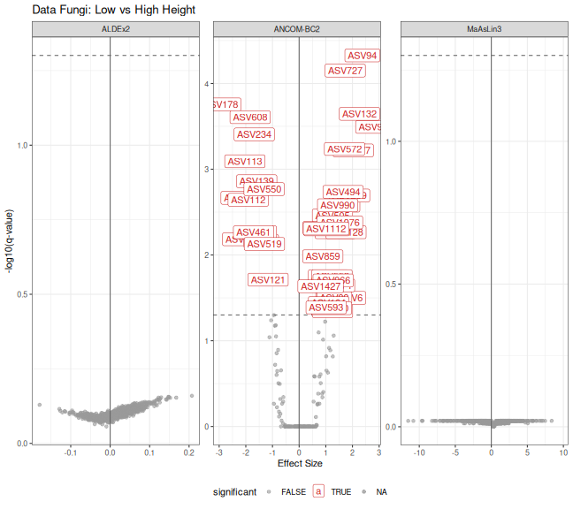
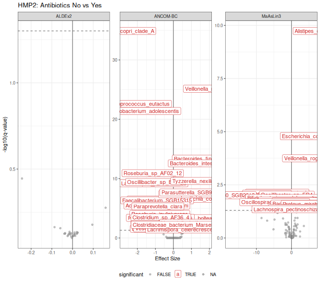
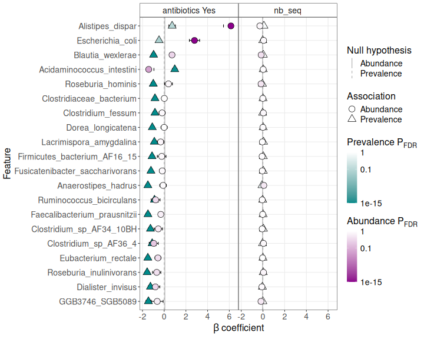
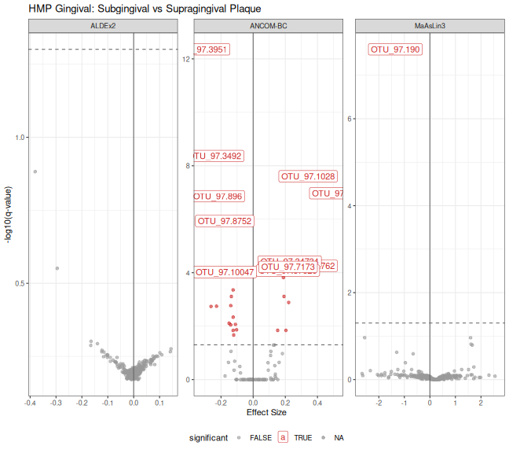
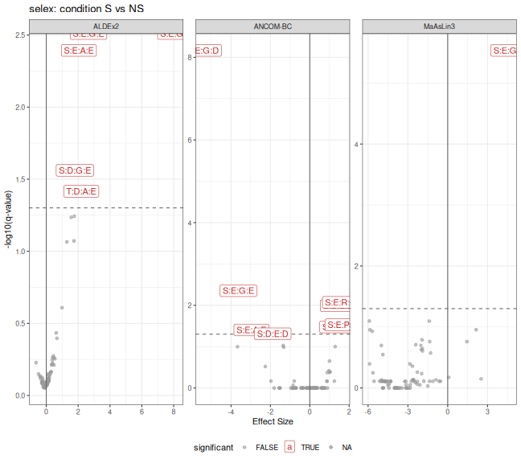
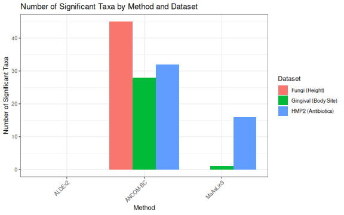

# Comparing Differential Abundance Methods

## Introduction

This vignette compares three popular differential abundance (DA) methods
for microbiome data:

- **ANCOM-BC2** (Analysis of Compositions of Microbiomes with Bias
  Correction): Uses a linear regression framework with bias correction
  for compositionality
- **ALDEx2** (ANOVA-Like Differential Expression): Uses centered
  log-ratio transformation and Monte Carlo sampling from Dirichlet
  distribution
- **MaAsLin3** (Microbiome Multivariable Associations with Linear
  Models): Fits generalized linear models with options for both
  abundance and prevalence

We compare these methods on three different datasets to illustrate their
behavior across different experimental designs and data characteristics.

## Setup

``` r

library(comparpq)
library(phyloseq)
library(ggplot2)
library(dplyr)
library(patchwork)
```

## Dataset 1: Fungi and Tree Height

The `data_fungi` dataset from MiscMetabar contains fungal communities
sampled at different heights on trees. We compare Low vs High height
positions.

### Data Preparation

``` r

data("data_fungi", package = "MiscMetabar")

# Subset to Low and High only for a clear binary comparison
data_fungi_hl <- subset_samples(data_fungi, Height %in% c("Low", "High"))
data_fungi_hl <- prune_taxa(taxa_sums(data_fungi_hl) > 0, data_fungi_hl)

cat("Dataset: data_fungi (Low vs High)\n")
#> Dataset: data_fungi (Low vs High)
cat("Samples:", nsamples(data_fungi_hl), "\n")
#> Samples: 86
cat("Taxa:", ntaxa(data_fungi_hl), "\n")
#> Taxa: 1164
cat("Groups:", table(sample_data(data_fungi_hl)$Height), "\n")
#> Groups: 41 45
```

### Run ANCOM-BC

``` r

res_ancombc_fungi <- MiscMetabar::ancombc_pq(
  data_fungi_hl,
  fact = "Height",
  levels_fact = c("Low", "High"),
  tax_level = NULL
)
```

``` r

# Extract results
ancombc_df_fungi <- res_ancombc_fungi$res |>
  filter(!is.na(lfc_HeightHigh)) |>
  mutate(
    method = "ANCOM-BC2",
    effect = lfc_HeightHigh,
    qvalue = q_HeightHigh,
    significant = diff_HeightHigh
  ) |>
  dplyr::select(taxon, method, effect, qvalue, significant)

cat("ANCOM-BC significant taxa:", sum(ancombc_df_fungi$significant), "\n")
#> ANCOM-BC significant taxa: 45
```

### Run ALDEx2

``` r

res_aldex_fungi <- MiscMetabar::aldex_pq(
  data_fungi_hl,
  bifactor = "Height",
  modalities = c("Low", "High")
)
```

``` r

aldex_df_fungi <- res_aldex_fungi |>
  tibble::rownames_to_column("taxon") |>
  mutate(
    method = "ALDEx2",
    effect = effect,
    qvalue = wi.eBH,
    significant = wi.eBH < 0.05
  ) |>
  dplyr::select(taxon, method, effect, qvalue, significant)

cat("ALDEx2 significant taxa:", sum(aldex_df_fungi$significant), "\n")
#> ALDEx2 significant taxa: 0
```

### Run MaAsLin3

``` r

res_maaslin3_fungi <- maaslin3_pq(
  data_fungi_hl,
  formula = "~ Height",
  reference = list(Height = "Low"),
  output = tempfile(),
  correction_for_sample_size = FALSE,
  plot_summary_plot = FALSE,
  plot_associations = FALSE
)
```

``` r

maaslin3_df_fungi <- res_maaslin3_fungi$fit_data_abundance$results |>
  filter(metadata == "Height") |>
  mutate(
    taxon = feature,
    method = "MaAsLin3",
    effect = coef,
    qvalue = qval_individual,
    significant = qval_individual < 0.05
  ) |>
  dplyr::select(taxon, method, effect, qvalue, significant)

cat("MaAsLin3 significant taxa:", sum(maaslin3_df_fungi$significant, na.rm = TRUE), "\n")
#> MaAsLin3 significant taxa: 0
```

### Compare Results

``` r

# Combine results
combined_fungi <- bind_rows(ancombc_df_fungi, aldex_df_fungi, maaslin3_df_fungi)

# Volcano plots
p_volcano_fungi <- ggplot(
  combined_fungi,
  aes(x = effect, y = -log10(qvalue), color = significant)
) +
  geom_point(alpha = 0.6) +
  geom_hline(yintercept = -log10(0.05), linetype = "dashed", color = "grey40") +
  geom_vline(xintercept = 0, color = "grey40") +
  scale_color_manual(values = c("FALSE" = "grey60", "TRUE" = "firebrick3")) +
  facet_wrap(~method, scales = "free") +
  labs(
    title = "Data Fungi: Low vs High Height",
    x = "Effect Size",
    y = "-log10(q-value)"
  ) +
  theme_bw() +
  theme(legend.position = "bottom") +
  geom_label(
    data = combined_fungi %>% filter(significant),
    aes(label=taxon)
  )

print(p_volcano_fungi)
```



plot of chunk fungi_compare

``` r

# Find overlapping significant taxa
sig_ancombc <- ancombc_df_fungi$taxon[ancombc_df_fungi$significant]
sig_aldex <- aldex_df_fungi$taxon[aldex_df_fungi$significant]
sig_maaslin3 <- na.omit(maaslin3_df_fungi$taxon[maaslin3_df_fungi$significant])

# Overlap summary
cat("\nSignificant taxa overlap:\n")
#> 
#> Significant taxa overlap:
cat("ANCOM-BC only:", length(setdiff(sig_ancombc, union(sig_aldex, sig_maaslin3))), "\n")
#> ANCOM-BC only: 45
cat("ALDEx2 only:", length(setdiff(sig_aldex, union(sig_ancombc, sig_maaslin3))), "\n")
#> ALDEx2 only: 0
cat("MaAsLin3 only:", length(setdiff(sig_maaslin3, union(sig_ancombc, sig_aldex))), "\n")
#> MaAsLin3 only: 0
cat("All three:", length(Reduce(intersect, list(sig_ancombc, sig_aldex, sig_maaslin3))), "\n")
#> All three: 0
```

## Dataset 2: HMP2 and Antibiotics

The HMP2 dataset from the maaslin3 package contains gut microbiome data
from the Human Microbiome Project 2. We compare samples with and without
antibiotic usage.

### Data Preparation

``` r

# Read the HMP2 default dataset from maaslin3 package
taxa_table_name <- system.file("extdata", "HMP2_taxonomy.tsv", package = "maaslin3")
taxa_table <- read.csv(taxa_table_name, sep = "\t", row.names = 1)

metadata_name <- system.file("extdata", "HMP2_metadata.tsv", package = "maaslin3")
metadata <- read.csv(metadata_name, sep = "\t", row.names = 1)

# Set factor levels
metadata$antibiotics <- factor(metadata$antibiotics, levels = c("No", "Yes"))

# Create phyloseq object
otu <- otu_table(as.matrix(taxa_table), taxa_are_rows = FALSE)
sam <- sample_data(metadata)
species_names <- colnames(taxa_table)
tax_df <- data.frame(
  Species = species_names,
  Genus = sapply(strsplit(species_names, "_"), \(x) x[1]),
  row.names = species_names
)
tax <- tax_table(as.matrix(tax_df))
physeq_hmp2 <- phyloseq(otu, sam, tax)

cat("Dataset: HMP2 (Antibiotics No vs Yes)\n")
#> Dataset: HMP2 (Antibiotics No vs Yes)
cat("Samples:", nsamples(physeq_hmp2), "\n")
#> Samples: 1527
cat("Taxa:", ntaxa(physeq_hmp2), "\n")
#> Taxa: 151
cat("Groups:", table(sample_data(physeq_hmp2)$antibiotics), "\n")
#> Groups: 1374 153
```

### Run ANCOM-BC

``` r

res_ancombc_hmp2 <- MiscMetabar::ancombc_pq(
  physeq_hmp2,
  fact = "antibiotics",
  levels_fact = c("No", "Yes"),
  tax_level = NULL
)
```

``` r

ancombc_df_hmp2 <- res_ancombc_hmp2$res |>
  filter(!is.na(lfc_antibioticsYes)) |>
  mutate(
    method = "ANCOM-BC",
    effect = lfc_antibioticsYes,
    qvalue = q_antibioticsYes,
    significant = diff_antibioticsYes
  ) |>
  dplyr::select(taxon, method, effect, qvalue, significant)

cat("ANCOM-BC significant taxa:", sum(ancombc_df_hmp2$significant), "\n")
#> ANCOM-BC significant taxa: 32
```

### Run ALDEx2

``` r

physeq_hmp2@sam_data$antibiotics <- as.character(physeq_hmp2@sam_data$antibiotics)
physeq_hmp2@otu_table <- otu_table(
  round(as.matrix(physeq_hmp2@otu_table))*1000,
  taxa_are_rows = taxa_are_rows(physeq_hmp2)
)

res_aldex_hmp2 <- MiscMetabar::aldex_pq(
  physeq_hmp2,
  test="t",
  bifactor = "antibiotics",
  modalities = c("No", "Yes")
)
```

``` r

aldex_df_hmp2 <- res_aldex_hmp2 |>
  tibble::rownames_to_column("taxon") |>
  mutate(
    method = "ALDEx2",
    effect = effect,
    qvalue = wi.eBH,
    significant = wi.eBH < 0.05
  ) |>
  dplyr::select(taxon, method, effect, qvalue, significant)

cat("ALDEx2 significant taxa:", sum(aldex_df_hmp2$significant), "\n")
#> ALDEx2 significant taxa: 0
```

### Run MaAsLin3

``` r

otu_maaslin <- otu_table(as.matrix(taxa_table), taxa_are_rows = FALSE)
sam_maaslin <- sample_data(metadata)
physeq_hmp2_maaslin <- phyloseq(otu_maaslin, sam_maaslin, tax)

res_maaslin3_hmp2 <- maaslin3_pq(
  physeq_hmp2_maaslin,
  formula = "~ antibiotics",
  reference = list(antibiotics = "No"),
  output = tempfile()
)
```

``` r

maaslin3_df_hmp2 <- res_maaslin3_hmp2$fit_data_abundance$results |>
  filter(metadata == "antibiotics") |>
  mutate(
    taxon = feature,
    method = "MaAsLin3",
    effect = coef,
    qvalue = qval_individual,
    significant = qval_individual < 0.05
  ) |>
  dplyr::select(taxon, method, effect, qvalue, significant)

cat("MaAsLin3 significant taxa:", sum(maaslin3_df_hmp2$significant, na.rm = TRUE), "\n")
#> MaAsLin3 significant taxa: 16
```

### Compare Results

``` r

combined_hmp2 <- bind_rows(ancombc_df_hmp2, aldex_df_hmp2, maaslin3_df_hmp2)

p_volcano_hmp2 <- ggplot(
  combined_hmp2,
  aes(x = effect, y = -log10(qvalue), color = significant)
) +
  geom_point(alpha = 0.6) +
  geom_hline(yintercept = -log10(0.05), linetype = "dashed", color = "grey40") +
  geom_vline(xintercept = 0, color = "grey40") +
  scale_color_manual(values = c("FALSE" = "grey60", "TRUE" = "firebrick3")) +
  facet_wrap(~method, scales = "free") +
  labs(
    title = "HMP2: Antibiotics No vs Yes",
    x = "Effect Size",
    y = "-log10(q-value)"
  ) +
  theme_bw() +
  theme(legend.position = "bottom") +
  geom_label(
    data = combined_hmp2 %>% filter(significant),
    aes(label=taxon)
  )

print(p_volcano_hmp2)
```



plot of chunk hmp2_compare

### MaAsLin3 Summary Plot

``` r

# Use the default summary plot from gg_maaslin3_plot
p_summary <- gg_maaslin3_plot(res_maaslin3_hmp2, type = "summary", top_n = 20)
#> 2026-06-18 14:00:23.37 INFO::Writing summary plot of significant
#>                         results to file: /tmp/Rtmp09ymqj/maaslin3_plot_8cc1263c2fb0a/figures/summary_plot.pdf
print(p_summary)
```



plot of chunk hmp2_summary

## Dataset 3: HMP Gingival Microbiome

The HMP_2012_16S_gingival_V13 dataset from MicrobiomeBenchmarkData
contains oral microbiome data comparing subgingival and supragingival
plaque.

### Data Preparation

``` r

# Get the dataset
gingival_data <- MicrobiomeBenchmarkData::getBenchmarkData(
  "HMP_2012_16S_gingival_V13",
  dryrun = FALSE
)[[1]]

# Convert to phyloseq
gingival_pq <- mia::convertToPhyloseq(gingival_data)
gingival_pq@tax_table <- tax_table(data.frame(
  Genus = paste0("Genus", 1:ntaxa(gingival_pq)),
  row.names = taxa_names(gingival_pq)
))

taxa_names(gingival_pq) <- names(gingival_data)

# Subset gingival_pq to only 1000 taxa for efficiency
set.seed(123)
selected_taxa <- sample(taxa_names(gingival_pq), 1000)
gingival_pq <- prune_taxa(selected_taxa, gingival_pq)

cat("Dataset: HMP Gingival (subgingival vs supragingival plaque)\n")
#> Dataset: HMP Gingival (subgingival vs supragingival plaque)
cat("Samples:", nsamples(gingival_pq), "\n")
#> Samples: 311
cat("Taxa:", ntaxa(gingival_pq), "\n")
#> Taxa: 1000
cat("Groups:", table(sample_data(gingival_pq)$body_subsite), "\n")
#> Groups: 152 159
```

### Run ANCOM-BC

``` r

res_ancombc_ging <- MiscMetabar::ancombc_pq(
  gingival_pq,
  fact = "body_subsite",
  levels_fact = c("subgingival_plaque", "supragingival_plaque"),
  tax_level = NULL
)
```

``` r

# Column name varies based on factor level
lfc_col <- grep("^lfc_", colnames(res_ancombc_ging$res), value = TRUE)[1]
q_col <- grep("^q_", colnames(res_ancombc_ging$res), value = TRUE)[1]
diff_col <- grep("^diff_", colnames(res_ancombc_ging$res), value = TRUE)[1]

ancombc_df_ging <- res_ancombc_ging$res |>
  filter(!is.na(.data[[lfc_col]])) |>
  mutate(
    method = "ANCOM-BC",
    effect = .data[[lfc_col]],
    qvalue = .data[[q_col]],
    significant = .data[[diff_col]]
  ) |>
  dplyr::select(taxon, method, effect, qvalue, significant)

cat("ANCOM-BC significant taxa:", sum(ancombc_df_ging$significant), "\n")
#> ANCOM-BC significant taxa: 28
```

### Run ALDEx2

``` r

res_aldex_ging <- MiscMetabar::aldex_pq(
  gingival_pq,
  bifactor = "body_subsite",
  modalities = c("subgingival_plaque", "supragingival_plaque")
)
```

``` r

aldex_df_ging <- res_aldex_ging |>
  tibble::rownames_to_column("taxon") |>
  mutate(
    method = "ALDEx2",
    effect = effect,
    qvalue = wi.eBH,
    significant = wi.eBH < 0.05
  ) |>
  dplyr::select(taxon, method, effect, qvalue, significant)

cat("ALDEx2 significant taxa:", sum(aldex_df_ging$significant), "\n")
#> ALDEx2 significant taxa: 0
```

### Run MaAsLin3

``` r

res_maaslin3_ging <- maaslin3_pq(
  gingival_pq,
  formula = "~ body_subsite",
  reference = list(body_subsite = "subgingival_plaque"),
  output = tempfile(),
  correction_for_sample_size = FALSE,
  plot_summary_plot = FALSE,
  plot_associations = FALSE
)
```

``` r

maaslin3_df_ging <- res_maaslin3_ging$fit_data_abundance$results |>
  filter(grepl("body_subsite", metadata)) |>
  mutate(
    taxon = feature,
    method = "MaAsLin3",
    effect = coef,
    qvalue = qval_individual,
    significant = qval_individual < 0.05
  ) |>
  dplyr::select(taxon, method, effect, qvalue, significant)

cat("MaAsLin3 significant taxa:", sum(maaslin3_df_ging$significant, na.rm = TRUE), "\n")
#> MaAsLin3 significant taxa: 1
```

### Compare Results

``` r

combined_ging <- bind_rows(ancombc_df_ging, aldex_df_ging, maaslin3_df_ging)

p_volcano_ging <- ggplot(
  combined_ging,
  aes(x = effect, y = -log10(qvalue), color = significant)
) +
  geom_point(alpha = 0.6) +
  geom_hline(yintercept = -log10(0.05), linetype = "dashed", color = "grey40") +
  geom_vline(xintercept = 0, color = "grey40") +
  scale_color_manual(values = c("FALSE" = "grey60", "TRUE" = "firebrick3")) +
  facet_wrap(~method, scales = "free") +
  labs(
    title = "HMP Gingival: Subgingival vs Supragingival Plaque",
    x = "Effect Size",
    y = "-log10(q-value)"
  ) +
  theme_bw() +
  theme(legend.position = "bottom") +
  geom_label(
    data = combined_ging %>% filter(qvalue < 0.0001),
    aes(label=taxon)
  )

print(p_volcano_ging)
```



plot of chunk gingival_compare

## Dataset 4: selex

``` r

library(ALDEx2)
data(selex)
selex <- selex[1201:1300,] # subset for efficiency
conds <- c(rep("NS", 7), rep("S", 7))

physeq_selex <- phyloseq(otu_table(selex, taxa_are_rows = TRUE), 
          sample_data(data.frame(condition = conds, row.names = colnames(selex))))

physeq_selex@tax_table <-  tax_table(data.frame(Genus = paste0("Genus", 1:100), row.names = rownames(selex)))

taxa_names(physeq_selex) <- rownames(selex)
```

### Run ANCOM-BC

``` r

res_ancombc_selex <- MiscMetabar::ancombc_pq(
  physeq_selex,
  fact = "condition",
  levels_fact = c("S", "NS"),
  tax_level = NULL
)
```

``` r

ancombc_df_selex <- res_ancombc_selex$res |>
  filter(!is.na(lfc_conditionNS)) |>
  mutate(
    method = "ANCOM-BC",
    effect = lfc_conditionNS,
    qvalue = q_conditionNS,
    significant = diff_conditionNS
  ) |>
  dplyr::select(taxon, method, effect, qvalue, significant)

cat("ANCOM-BC significant taxa:", sum(ancombc_df_selex$significant), "\n")
#> ANCOM-BC significant taxa: 8
```

### Run ALDEx2

``` r

res_aldex_selex <- MiscMetabar::aldex_pq(
  physeq_selex,
  test="t",
  bifactor = "condition",
  modalities = c("S", "NS")
)
```

``` r

aldex_df_selex <- res_aldex_selex |>
  tibble::rownames_to_column("taxon") |>
  mutate(
    method = "ALDEx2",
    effect = effect,
    qvalue = wi.eBH,
    significant = wi.eBH < 0.05
  ) |>
  dplyr::select(taxon, method, effect, qvalue, significant)

cat("ALDEx2 significant taxa:", sum(aldex_df_selex$significant), "\n")
#> ALDEx2 significant taxa: 5
```

### Run MaAsLin3

``` r

res_maaslin3_selex <- maaslin3_pq(
  physeq_selex,
  formula = "~ condition",
  reference = list(S = "S"),
  output = tempfile()
)
```

``` r

maaslin3_df_selex <- res_maaslin3_selex$fit_data_abundance$results |>
  filter(metadata == "condition") |>
  mutate(
    taxon = feature,
    method = "MaAsLin3",
    effect = coef,
    qvalue = qval_individual,
    significant = qval_individual < 0.05
  ) |>
  dplyr::select(taxon, method, effect, qvalue, significant)

cat("MaAsLin3 significant taxa:", sum(maaslin3_df_selex$significant, na.rm = TRUE), "\n")
#> MaAsLin3 significant taxa: 1
```

### Compare Results

``` r

combined_selex <- bind_rows(ancombc_df_selex, aldex_df_selex, maaslin3_df_selex)

p_volcano_selex <- ggplot(
  combined_selex,
  aes(x = effect, y = -log10(qvalue), color = significant)
) +
  geom_point(alpha = 0.6) +
  geom_hline(yintercept = -log10(0.05), linetype = "dashed", color = "grey40") +
  geom_vline(xintercept = 0, color = "grey40") +
  scale_color_manual(values = c("FALSE" = "grey60", "TRUE" = "firebrick3")) +
  facet_wrap(~method, scales = "free") +
  labs(
    title = "selex: condition S vs NS",
    x = "Effect Size",
    y = "-log10(q-value)"
  ) +
  theme_bw() +
  theme(legend.position = "bottom") +
  geom_label(
    data = combined_selex %>% filter(significant),
    aes(label=taxon)
  )

print(p_volcano_selex)
```



plot of chunk selex_compare

``` r

combined_selex |>
  filter(significant) |>
  group_by(taxon) |> 
  summarise(method_signif=n(), method=paste(method, collapse="; ")) |>
  arrange(method_signif)
#> # A tibble: 10 × 3
#>    taxon   method_signif method                    
#>    <chr>           <int> <chr>                     
#>  1 S:D:E:D             1 ANCOM-BC                  
#>  2 S:D:G:E             1 ALDEx2                    
#>  3 S:D:L:D             1 ANCOM-BC                  
#>  4 S:D:L:E             1 ANCOM-BC                  
#>  5 S:E:P:D             1 ANCOM-BC                  
#>  6 S:E:R:E             1 ANCOM-BC                  
#>  7 T:D:A:E             1 ALDEx2                    
#>  8 S:E:A:E             2 ANCOM-BC; ALDEx2          
#>  9 S:E:G:E             2 ANCOM-BC; ALDEx2          
#> 10 S:E:G:D             3 ANCOM-BC; ALDEx2; MaAsLin3
```

## Summary Across Datasets

``` r

# Create summary table
summary_df <- tibble::tribble(
  ~Dataset, ~Method, ~`Total Taxa`, ~`Significant Taxa`,
  "Fungi (Height)", "ANCOM-BC", nrow(ancombc_df_fungi), sum(ancombc_df_fungi$significant),
  "Fungi (Height)", "ALDEx2", nrow(aldex_df_fungi), sum(aldex_df_fungi$significant),
  "Fungi (Height)", "MaAsLin3", nrow(maaslin3_df_fungi), sum(maaslin3_df_fungi$significant, na.rm = TRUE),
  "HMP2 (Antibiotics)", "ANCOM-BC", nrow(ancombc_df_hmp2), sum(ancombc_df_hmp2$significant),
  "HMP2 (Antibiotics)", "ALDEx2", nrow(aldex_df_hmp2), sum(aldex_df_hmp2$significant),
  "HMP2 (Antibiotics)", "MaAsLin3", nrow(maaslin3_df_hmp2), sum(maaslin3_df_hmp2$significant, na.rm = TRUE),
  "Gingival (Body Site)", "ANCOM-BC", nrow(ancombc_df_ging), sum(ancombc_df_ging$significant),
  "Gingival (Body Site)", "ALDEx2", nrow(aldex_df_ging), sum(aldex_df_ging$significant),
  "Gingival (Body Site)", "MaAsLin3", nrow(maaslin3_df_ging), sum(maaslin3_df_ging$significant, na.rm = TRUE)
)

knitr::kable(summary_df, caption = "Summary of Differential Abundance Results")
```

| Dataset              | Method   | Total Taxa | Significant Taxa |
|:---------------------|:---------|-----------:|-----------------:|
| Fungi (Height)       | ANCOM-BC |        162 |               45 |
| Fungi (Height)       | ALDEx2   |       1164 |                0 |
| Fungi (Height)       | MaAsLin3 |        869 |                0 |
| HMP2 (Antibiotics)   | ANCOM-BC |        109 |               32 |
| HMP2 (Antibiotics)   | ALDEx2   |         30 |                0 |
| HMP2 (Antibiotics)   | MaAsLin3 |        151 |               16 |
| Gingival (Body Site) | ANCOM-BC |         89 |               28 |
| Gingival (Body Site) | ALDEx2   |        389 |                0 |
| Gingival (Body Site) | MaAsLin3 |        317 |                1 |

Summary of Differential Abundance Results {.table}

``` r

summary_df |>
  mutate(Proportion = `Significant Taxa` / `Total Taxa`) |>
  ggplot(aes(x = Method, y = `Significant Taxa`, fill = Dataset)) +
  geom_col(position = "dodge") +
  labs(
    title = "Number of Significant Taxa by Method and Dataset",
    y = "Number of Significant Taxa"
  ) +
  theme_bw() +
  theme(axis.text.x = element_text(angle = 45, hjust = 1))
```



plot of chunk summary_plot

## Discussion

The three methods show different sensitivities across datasets:

1.  **ANCOM-BC** tends to detect more significant taxa, especially in
    datasets with clear biological differences. It accounts for sampling
    fraction bias and provides log fold change estimates.

2.  **ALDEx2** is generally more conservative, using Monte Carlo
    sampling from the Dirichlet distribution to account for uncertainty.
    It tends to have fewer false positives but may miss some true
    effects.

3.  **MaAsLin3** provides a flexible framework with both abundance and
    prevalence models. Its sensitivity depends on the transformation and
    normalization settings used.

## Session Info

``` r

sessionInfo()
#> R version 4.6.0 (2026-04-24)
#> Platform: x86_64-pc-linux-gnu
#> Running under: Pop!_OS 24.04 LTS
#> 
#> Matrix products: default
#> BLAS:   /usr/lib/x86_64-linux-gnu/openblas-pthread/libblas.so.3 
#> LAPACK: /usr/lib/x86_64-linux-gnu/openblas-pthread/libopenblasp-r0.3.26.so;  LAPACK version 3.12.0
#> 
#> locale:
#>  [1] LC_CTYPE=en_US.UTF-8       LC_NUMERIC=C              
#>  [3] LC_TIME=en_US.UTF-8        LC_COLLATE=en_US.UTF-8    
#>  [5] LC_MONETARY=en_US.UTF-8    LC_MESSAGES=en_US.UTF-8   
#>  [7] LC_PAPER=en_US.UTF-8       LC_NAME=C                 
#>  [9] LC_ADDRESS=C               LC_TELEPHONE=C            
#> [11] LC_MEASUREMENT=en_US.UTF-8 LC_IDENTIFICATION=C       
#> 
#> time zone: Europe/Paris
#> tzcode source: system (glibc)
#> 
#> attached base packages:
#> [1] stats     graphics  grDevices utils     datasets  methods   base     
#> 
#> other attached packages:
#>  [1] ALDEx2_1.44.0       latticeExtra_0.6-31 lattice_0.22-9     
#>  [4] zCompositions_1.6.1 survival_3.8-6      truncnorm_1.0-9    
#>  [7] MASS_7.3-65         doRNG_1.8.6.3       rngtools_1.5.2     
#> [10] foreach_1.5.2       patchwork_1.3.2     comparpq_0.1.3     
#> [13] S7_0.2.2            MiscMetabar_0.16.8  dplyr_1.2.1        
#> [16] ggplot2_4.0.3       phyloseq_1.56.0     knitr_1.51         
#> 
#> loaded via a namespace (and not attached):
#>   [1] fs_2.1.0                        matrixStats_1.5.0              
#>   [3] DirichletMultinomial_1.54.0     httr_1.4.8                     
#>   [5] RColorBrewer_1.1-3              doParallel_1.0.17              
#>   [7] numDeriv_2016.8-1.1             tools_4.6.0                    
#>   [9] backports_1.5.1                 utf8_1.2.6                     
#>  [11] R6_2.6.1                        vegan_2.7-5                    
#>  [13] lazyeval_0.2.3                  mgcv_1.9-4                     
#>  [15] permute_0.9-10                  withr_3.0.2                    
#>  [17] gridExtra_2.3                   textshaping_1.0.5              
#>  [19] cli_3.6.6                       Biobase_2.72.0                 
#>  [21] logging_0.10-111                sandwich_3.1-1                 
#>  [23] labeling_0.4.3                  mvtnorm_1.4-1                  
#>  [25] readr_2.2.0                     proxy_0.4-29                   
#>  [27] maaslin3_1.4.0                  systemfonts_1.3.2              
#>  [29] yulab.utils_0.2.4               foreign_0.8-91                 
#>  [31] scater_1.40.1                   decontam_1.32.0                
#>  [33] collapse_2.1.7                  readxl_1.5.0                   
#>  [35] RSQLite_3.53.1                  rstudioapi_0.19.0              
#>  [37] generics_0.1.4                  gridGraphics_0.5-1             
#>  [39] shape_1.4.6.1                   gtools_3.9.5                   
#>  [41] scam_1.2-22                     interp_1.1-6                   
#>  [43] Matrix_1.7-5                    biomformat_1.40.0              
#>  [45] ggbeeswarm_0.7.3                DescTools_0.99.60              
#>  [47] S4Vectors_0.50.1                DECIPHER_3.8.0                 
#>  [49] abind_1.4-8                     lifecycle_1.0.5                
#>  [51] multcomp_1.4-30                 SummarizedExperiment_1.42.0    
#>  [53] BiocFileCache_3.2.0             Rtsne_0.17                     
#>  [55] SparseArray_1.12.2              blob_1.3.0                     
#>  [57] grid_4.6.0                      crayon_1.5.3                   
#>  [59] haven_2.5.5                     beachmat_2.28.0                
#>  [61] pillar_1.11.1                   optparse_1.8.2                 
#>  [63] GenomicRanges_1.64.0            boot_1.3-32                    
#>  [65] gld_2.6.8                       estimability_1.5.1             
#>  [67] codetools_0.2-20                glue_1.8.1                     
#>  [69] ggiraph_0.9.6                   ggfun_0.2.0                    
#>  [71] fontLiberation_0.1.0            data.table_1.18.4              
#>  [73] MultiAssayExperiment_1.38.0     png_0.1-9                      
#>  [75] vctrs_0.7.3                     treeio_1.36.1                  
#>  [77] Rdpack_2.6.6                    cellranger_1.1.0               
#>  [79] gtable_0.3.6                    cachem_1.1.0                   
#>  [81] zigg_0.0.2                      xfun_0.58                      
#>  [83] rbibutils_2.4.1                 S4Arrays_1.12.0                
#>  [85] Rfast_2.1.5.2                   Seqinfo_1.2.0                  
#>  [87] reformulas_0.4.4                coda_0.19-4.1                  
#>  [89] SingleCellExperiment_1.34.0     iterators_1.0.14               
#>  [91] MicrobiomeBenchmarkData_1.14.0  bluster_1.22.0                 
#>  [93] directlabels_2026.4.23          TH.data_1.1-5                  
#>  [95] nlme_3.1-169                    ANCOMBC_2.14.0                 
#>  [97] ggtree_4.2.0                    bit64_4.8.2                    
#>  [99] fontquiver_0.2.1                filelock_1.0.3                 
#> [101] irlba_2.3.7                     vipor_0.4.7                    
#> [103] otel_0.2.0                      rpart_4.1.27                   
#> [105] colorspace_2.1-2                BiocGenerics_0.58.1            
#> [107] DBI_1.3.0                       Hmisc_5.2-5                    
#> [109] nnet_7.3-20                     ade4_1.7-24                    
#> [111] Exact_3.3                       tidyselect_1.2.1               
#> [113] emmeans_2.0.3                   curl_7.1.0                     
#> [115] bit_4.6.0                       compiler_4.6.0                 
#> [117] microbiome_1.34.0               httr2_1.2.2                    
#> [119] htmlTable_2.5.0                 BiocNeighbors_2.6.0            
#> [121] expm_1.0-0                      fontBitstreamVera_0.1.1        
#> [123] DelayedArray_0.38.2             checkmate_2.3.4                
#> [125] scales_1.4.0                    phylogram_2.1.0                
#> [127] quadprog_1.5-8                  multcompView_0.1-11            
#> [129] rappdirs_0.3.4                  stringr_1.6.0                  
#> [131] digest_0.6.39                   mirai_2.7.1                    
#> [133] minqa_1.2.8                     rmarkdown_2.31                 
#> [135] XVector_0.52.0                  jpeg_0.1-11                    
#> [137] htmltools_0.5.9                 pkgconfig_2.0.3                
#> [139] base64enc_0.1-6                 lme4_2.0-1                     
#> [141] sparseMatrixStats_1.24.0        MatrixGenerics_1.24.0          
#> [143] dbplyr_2.5.2                    fastmap_1.2.0                  
#> [145] rlang_1.2.0                     GlobalOptions_0.1.4            
#> [147] htmlwidgets_1.6.4               DelayedMatrixStats_1.34.0      
#> [149] farver_2.1.2                    zoo_1.8-15                     
#> [151] jsonlite_2.0.0                  energy_1.7-12                  
#> [153] BiocParallel_1.46.0             BiocSingular_1.28.0            
#> [155] magrittr_2.0.5                  Formula_1.2-5                  
#> [157] scuttle_1.22.0                  ggplotify_0.1.3                
#> [159] Rcpp_1.1.1-1.1                  ggnewscale_0.5.2               
#> [161] ape_5.8-1                       viridis_0.6.5                  
#> [163] gdtools_0.5.1                   stringi_1.8.7                  
#> [165] ggalluvial_0.12.6               rootSolve_1.8.2.4              
#> [167] plyr_1.8.9                      parallel_4.6.0                 
#> [169] ggrepel_0.9.8                   forcats_1.0.1                  
#> [171] lmom_3.3                        deldir_2.0-4                   
#> [173] Biostrings_2.80.1               splines_4.6.0                  
#> [175] multtest_2.68.0                 hms_1.1.4                      
#> [177] circlize_0.4.18                 igraph_2.3.2                   
#> [179] reshape2_1.4.5                  stats4_4.6.0                   
#> [181] ScaledMatrix_1.20.0             MIDASim_2.0                    
#> [183] evaluate_1.0.5                  RcppParallel_5.1.11-2          
#> [185] kmer_1.1.3                      nanonext_1.9.1                 
#> [187] nloptr_2.2.1                    tzdb_0.5.0                     
#> [189] tidyr_1.3.2                     purrr_1.2.2                    
#> [191] ecodive_2.2.6                   formattable_0.2.1              
#> [193] rsvd_1.0.5                      xtable_1.8-8                   
#> [195] divent_0.5-4                    e1071_1.7-17                   
#> [197] tidytree_0.4.7                  ragg_1.5.2                     
#> [199] viridisLite_0.4.3               class_7.3-23                   
#> [201] gsl_2.1-9                       tibble_3.3.1                   
#> [203] lmerTest_3.2-1                  aplot_0.2.9                    
#> [205] memoise_2.0.1                   beeswarm_0.4.0                 
#> [207] IRanges_2.46.0                  cluster_2.1.8.2                
#> [209] TreeSummarizedExperiment_2.20.0 mia_1.20.0
```
