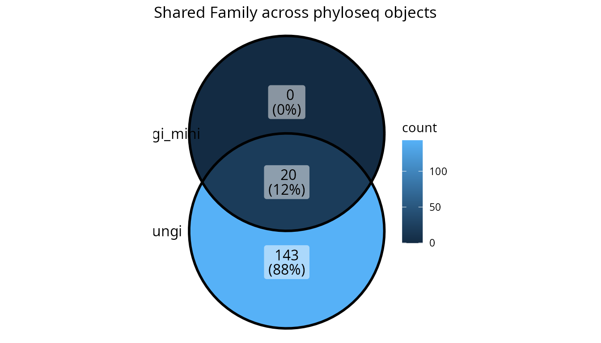
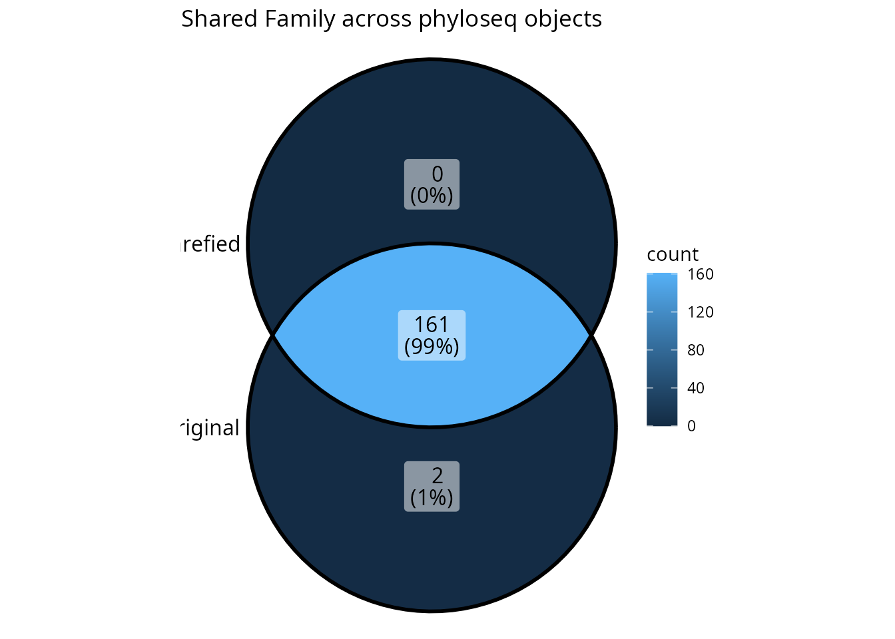

# The list_phyloseq Class

## Introduction

The `list_phyloseq` class is an S7 class designed to store and compare
multiple phyloseq objects. It automatically computes summary statistics
for each phyloseq object and determines the type of comparison based on:

- **Detected characteristics**: sample overlap, nested samples, shared
  modalities
- **User-provided parameters**: `same_primer_seq_tech` and
  `same_bioinfo_pipeline`

This vignette demonstrates:

- How to create `list_phyloseq` objects with the appropriate parameters
- The six types of comparisons and when to use them
- Utility functions for manipulating `list_phyloseq` objects
- Visualization functions for exploring and presenting results

## Setup

``` r
devtools::load_all()
# library(comparpq)
library(phyloseq)
```

## Creating a list_phyloseq Object

The simplest way to create a `list_phyloseq` is to pass a named list of
phyloseq objects. You can also specify the `same_primer_seq_tech` and
`same_bioinfo_pipeline` parameters to control the comparison type:

``` r
lpq <- list_phyloseq(list(
  fungi = data_fungi,
  fungi_mini = data_fungi_mini
))

lpq
#> list_phyloseq object with 2 phyloseq objects
#> 
#> --- Summary ---
#> # A tibble: 2 × 17
#>   name   n_samples n_taxa n_sequences n_occurence mean_seq_length min_seq_length
#>   <chr>      <int>  <int>       <dbl>       <int>           <dbl>          <int>
#> 1 fungi        185   1420     1839124       12499            318.            251
#> 2 fungi…       137     45      569525         560            343.            303
#> # ℹ 10 more variables: mean_seq_per_sample <dbl>, sd_seq_per_sample <dbl>,
#> #   min_seq_per_sample <dbl>, max_seq_per_sample <dbl>,
#> #   mean_seq_per_taxon <dbl>, sd_seq_per_taxon <dbl>, has_sam_data <lgl>,
#> #   has_tax_table <lgl>, has_refseq <lgl>, has_phy_tree <lgl>
#> 
#> --- Comparison characteristics ---
#> Type of comparison: NESTED_ROBUSTNESS 
#> Nested samples detected (one phyloseq derived from another).
#>   Nesting: fungi_mini (137 samples) is nested in fungi (185 samples)
#>   Useful to test robustness to data processing (e.g., rarefaction).
#>   Comparisons should focus on the common (nested) samples. 
#> 
#> Same primer/seq tech: TRUE 
#> Same bioinfo pipeline: TRUE 
#> Same sample_data structure: TRUE 
#> Same samples: FALSE 
#> Nested samples: TRUE 
#> Same taxa: FALSE 
#> Common samples: 137 
#> Common taxa: 45 
#> 
#> --- Reference sequence comparison ---
#> fungi_vs_fungi_mini: 45 shared seqs, 1375 unique in fungi, 0 unique in fungi_mini
```

The output shows:

- **Summary table**: Statistics for each phyloseq object (n_samples,
  n_taxa, n_sequences, etc.)
- **Comparison characteristics**: Type of comparison,
  same_primer_seq_tech, same_bioinfo_pipeline, sample overlap, shared
  modalities

### Key Parameters

When creating a `list_phyloseq`, you can specify:

- `same_primer_seq_tech` (logical, default TRUE): Set to FALSE when
  comparing different primers (e.g., ITS1 vs ITS2) or technologies
  (e.g., Illumina vs PacBio)
- `same_bioinfo_pipeline` (logical, default TRUE): Set to FALSE when
  comparing different clustering methods, taxonomic databases, or
  analysis parameters

## Types of Comparisons

The `list_phyloseq` class determines the type of comparison based on
detected sample overlap and the user-provided `same_primer_seq_tech` and
`same_bioinfo_pipeline` parameters. There are six main types:

### Summary of Comparison Types

Type \| Same Samples \| same primer/seq_tech \|same pipeline \| same
pipeline same modality \| Use Case \| same modality \|Use Case \|

\|——\|————–\|———————-\|———————–\|———-\|\|———-\| \| REPRODUCIBILITY \|
Yes \| TRUE \| TRUE \| TRUE \| Test reproducibility of identical
analysis \| \| ROBUSTNESS \| Yes \| TRUE \| FALSE \| TRUE \| Test effect
of different pipelines/parameters \| \| REPLICABILITY \| Yes \| FALSE
\| - \| TRUE \| Test effect of different primers/technologies \| \|
NESTED_ROBUSTNESS \| Nested \| - \| - \| TRUE \| Test effect of
rarefaction/filtering \| \| EXPLORATION \| No \| - \| - \| TRUE \|
Explore differences between sample groups \| \| SEPARATE_ANALYSIS \| No
\| - \| - \| FALSE \| Independent analyses (comparison may not be
meaningful) \|

### 1. REPRODUCIBILITY

When all phyloseq objects have the **same samples**, the **same
primer/technology** (`same_primer_seq_tech = TRUE`), and the **same
pipeline** (`same_bioinfo_pipeline = TRUE`, both defaults), the
comparison is classified as REPRODUCIBILITY.

``` r
# REPRODUCIBILITY: Same samples, same pipeline (default parameters)
# Example: Running the same analysis twice to test reproducibility
lpq_repro <- list_phyloseq(list(
  run1 = data_fungi,
  run2 = data_fungi
))

cat("Type:", lpq_repro@comparison$type_of_comparison, "\n")
#> Type: REPRODUCIBILITY
cat("Same primer/seq tech:", lpq_repro@comparison$same_primer_seq_tech, "\n")
#> Same primer/seq tech: TRUE
cat("Same bioinfo pipeline:", lpq_repro@comparison$same_bioinfo_pipeline, "\n")
#> Same bioinfo pipeline: TRUE
```

This can also be useful to test for effect of stochasticity in some
function.

``` r
# REPRODUCIBILITY: Same samples, same pipeline (default parameters)
# Example: Running the same analysis twice to test reproducibility
lpq_repro <- list_phyloseq(list(
  run1 = rarefy_even_depth(data_fungi, rngseed = 66),
  run2 = rarefy_even_depth(data_fungi, rngseed = 42)
))

cat("Type:", lpq_repro@comparison$type_of_comparison, "\n")
#> Type: REPRODUCIBILITY
cat("Same primer/seq tech:", lpq_repro@comparison$same_primer_seq_tech, "\n")
#> Same primer/seq tech: TRUE
cat("Same bioinfo pipeline:", lpq_repro@comparison$same_bioinfo_pipeline, "\n")
#> Same bioinfo pipeline: TRUE
```

### 2. ROBUSTNESS

When all phyloseq objects have the **same samples** and the **same
primer/technology**, but **different pipelines**
(`same_bioinfo_pipeline = FALSE`), the comparison is classified as
ROBUSTNESS.

``` r
# ROBUSTNESS: Same samples, different pipeline
# Example: Comparing different clustering methods or taxonomic databases
lpq_robust <- list_phyloseq(
  list(
    raw_fungi = data_fungi,
    fungi_swarm = postcluster_pq(data_fungi, method = "swarm"),
    fungi_mumu = mumu_pq(data_fungi)$new_physeq
  ),
  same_bioinfo_pipeline = FALSE # Different bioinformatics pipelines
)

cat("Type:", lpq_robust@comparison$type_of_comparison, "\n")
#> Type: ROBUSTNESS
cat("Same primer/seq tech:", lpq_robust@comparison$same_primer_seq_tech, "\n")
#> Same primer/seq tech: TRUE
cat("Same bioinfo pipeline:", lpq_robust@comparison$same_bioinfo_pipeline, "\n")
#> Same bioinfo pipeline: FALSE
```

### 3. REPLICABILITY

When all phyloseq objects have the **same samples** but **different
primers or technologies** (`same_primer_seq_tech = FALSE`), the
comparison is classified as REPLICABILITY.

``` r
# REPLICABILITY: Same samples, different primer/technology
# Example: Comparing ITS1 vs ITS2, or Illumina vs PacBio
lpq_replic <- list_phyloseq(
  list(
    ITS1 = data_fungi,
    ITS2 = data_fungi # In real use, this would be data from a different primer
  ),
  same_primer_seq_tech = FALSE # Different primers/technologies
)

cat("Type:", lpq_replic@comparison$type_of_comparison, "\n")
#> Type: REPLICABILITY
cat("Same primer/seq tech:", lpq_replic@comparison$same_primer_seq_tech, "\n")
#> Same primer/seq tech: FALSE
```

### 4. NESTED_ROBUSTNESS

When one phyloseq object is **derived from another** (e.g., rarefied
version), the samples from one are a subset of samples from another.
This type is detected automatically regardless of the
`same_primer_seq_tech` and `same_bioinfo_pipeline` parameters. It is
useful for testing robustness to data processing choices like
rarefaction or filtering.

``` r
# Create a rarefied version (samples may be lost if they don't meet depth threshold)
set.seed(123)
data_fungi_rarefied <- rarefy_even_depth(data_fungi, sample.size = 1000, verbose = FALSE)

lpq_nested <- list_phyloseq(list(
  original = data_fungi,
  rarefied = data_fungi_rarefied
))

# Check the comparison type
cat("Type:", lpq_nested@comparison$type_of_comparison, "\n")
#> Type: NESTED_ROBUSTNESS
cat("Nested samples:", lpq_nested@comparison$nested_samples, "\n")
#> Nested samples: TRUE
cat("Nesting structure:", lpq_nested@comparison$nesting_structure, "\n")
#> Nesting structure: rarefied (143 samples) is nested in original (185 samples)
```

The comparison should focus on the **common (nested) samples** to make
meaningful comparisons. Use
[`filter_common_lpq()`](https://adrientaudiere.github.io/comparpq/reference/filter_common_lpq.md)
for this (see [Utility Functions](#utility-functions)).

### 5. EXPLORATION

When phyloseq objects have **different samples but shared modalities**
in sample_data (e.g., same experimental conditions, same sites), the
comparison is classified as EXPLORATION. This type is detected
automatically based on sample_data.

``` r
# Simulate by subsetting samples from different parts of the dataset
# In real use, these would be different sample groups with shared experimental factors
sample_names_fungi <- sample_names(data_fungi)
n_samples <- length(sample_names_fungi)

# Split samples into two groups (simulating different sample sets with shared modalities)
group1_samples <- sample_names_fungi[1:floor(n_samples / 2)]
group2_samples <- sample_names_fungi[(floor(n_samples / 2) + 1):n_samples]

data_group1 <- prune_samples(group1_samples, data_fungi)
data_group2 <- prune_samples(group2_samples, data_fungi)

lpq_exploration <- list_phyloseq(list(
  group1 = data_group1,
  group2 = data_group2
))

cat("Type:", lpq_exploration@comparison$type_of_comparison, "\n")
#> Type: EXPLORATION
cat("Same samples:", lpq_exploration@comparison$same_samples, "\n")
#> Same samples: FALSE
cat("Common samples:", lpq_exploration@comparison$n_common_samples, "\n")
#> Common samples: 0
```

### 6. SEPARATE_ANALYSIS

When phyloseq objects have **different samples with no shared
modalities**, the comparison is classified as SEPARATE_ANALYSIS. Direct
comparison may not be meaningful. Separate analysis of each phyloseq
object is recommended.

``` r
# Example using completely different datasets
data("enterotype", package = "phyloseq")

lpq_separate <- list_phyloseq(list(
  fungi = data_fungi,
  enterotype = enterotype
))

cat("Type:", lpq_separate@comparison$type_of_comparison, "\n")
#> Type: SEPARATE_ANALYSIS
cat("Same samples:", lpq_separate@comparison$same_samples, "\n")
#> Same samples: FALSE
```

## Utility Functions

### Adding and Removing phyloseq Objects

``` r
# Start with a single phyloseq
lpq_single <- list_phyloseq(list(fungi = data_fungi))
cat("Initial number of phyloseq objects:", length(lpq_single), "\n")
#> Initial number of phyloseq objects: 1

# Add another phyloseq object
lpq_added <- add_phyloseq(lpq_single, data_fungi_mini, name = "fungi_mini")
cat("After adding:", length(lpq_added), "\n")
#> After adding: 2
cat("Names:", paste(names(lpq_added), collapse = ", "), "\n")
#> Names: fungi, fungi_mini

# Remove a phyloseq object
lpq_removed <- remove_phyloseq(lpq_added, "fungi_mini")
cat("After removing:", length(lpq_removed), "\n")
#> After removing: 1
```

### Updating Summary and Comparison

If you modify the phyloseq objects inside the list_phyloseq, use
[`update_list_phyloseq()`](https://adrientaudiere.github.io/comparpq/reference/update_list_phyloseq.md)
to recompute the summary table and comparison characteristics. You can
also use this function to change the `same_primer_seq_tech` or
`same_bioinfo_pipeline` parameters:

``` r
lpq@phyloseq_list[[1]] <- rarefy_even_depth(lpq@phyloseq_list[[1]])
lpq_updated <- update_list_phyloseq(lpq)

# Change the comparison type by modifying parameters
lpq_robustness <- update_list_phyloseq(lpq, same_bioinfo_pipeline = FALSE)
cat("New type:", lpq_robustness@comparison$type_of_comparison, "\n")
```

### Filtering to Common Samples and Taxa

The
[`filter_common_lpq()`](https://adrientaudiere.github.io/comparpq/reference/filter_common_lpq.md)
function filters each phyloseq object to retain only samples and/or taxa
that are common across all objects. This is particularly useful for:

- **NESTED_ROBUSTNESS** comparisons: filter to common samples when
  comparing original vs rarefied
- Any comparison where you need all phyloseq objects to have the same
  samples/taxa

``` r
# Create a list_phyloseq with nested samples
set.seed(123)
lpq_to_filter <- list_phyloseq(list(
  original = data_fungi,
  rarefied = rarefy_even_depth(data_fungi, sample.size = 1000, verbose = FALSE)
))

# Before filtering
cat("Before filtering:\n")
#> Before filtering:
cat("  Original samples:", nsamples(lpq_to_filter[["original"]]), "\n")
#>   Original samples: 185
cat("  Rarefied samples:", nsamples(lpq_to_filter[["rarefied"]]), "\n")
#>   Rarefied samples: 143
cat("  Common samples:", lpq_to_filter@comparison$n_common_samples, "\n")
#>   Common samples: 143

# Filter to keep only common samples
lpq_filtered <- filter_common_lpq(lpq_to_filter,
  filter_samples = TRUE,
  filter_taxa = FALSE,
  verbose = TRUE
)

# After filtering - both have the same samples
cat("\nAfter filtering:\n")
#> 
#> After filtering:
cat("  Original samples:", nsamples(lpq_filtered[["original"]]), "\n")
#>   Original samples: 143
cat("  Rarefied samples:", nsamples(lpq_filtered[["rarefied"]]), "\n")
#>   Rarefied samples: 143
cat("  Same samples now:", lpq_filtered@comparison$same_samples, "\n")
#>   Same samples now: TRUE
```

You can also filter to common taxa:

``` r
# Filter both samples and taxa
lpq_filtered_both <- filter_common_lpq(lpq_to_filter,
  filter_samples = TRUE,
  filter_taxa = TRUE
)
```

### Viewing Shared Modalities

The
[`shared_mod_lpq()`](https://adrientaudiere.github.io/comparpq/reference/shared_mod_lpq.md)
function displays which sample_data variable modalities are shared
across phyloseq objects:

``` r
shared_mod_lpq(lpq)
#> # A tibble: 5 × 3
#>   Variable     N_shared Shared_modalities                                       
#>   <chr>           <int> <chr>                                                   
#> 1 X                 137 A10-005-B_S188_MERGED.fastq.gz, A10-005-H_S189_MERGED.f…
#> 2 Sample_names      137 A10-005-B_S188, A10-005-H_S189, A10-005-M_S190, A12-007…
#> 3 Tree_name         100 A10-005, A12-007, A15-004, A8-005, AB29-abm-X, AC27-013…
#> 4 Height              4 Low, High, Middle, NA                                   
#> 5 Diameter           70 52, 28,4, 30,7, 32,8, 33,3, 99, 32, 55,4, 115,5, -, 10,…
```

This is useful for understanding what factors are common across your
datasets, especially for EXPLORATION type comparisons.

## Visualization Functions

### formattable_lpq: Summary Table Visualization

The
[`formattable_lpq()`](https://adrientaudiere.github.io/comparpq/reference/formattable_lpq.md)
function creates a beautiful HTML table showing the summary statistics
with colored bars and indicators:

``` r
# Basic formattable visualization
formattable_lpq(lpq)

# Custom columns selection
formattable_lpq(lpq, columns = c("name", "n_samples", "n_taxa", "n_sequences"))

# Custom colors for bars
formattable_lpq(lpq, bar_colors = list(
  n_samples = "steelblue",
  n_taxa = "darkgreen"
))
```

For a more complete view including comparison characteristics:

``` r
# Get both summary and comparison tables
result <- formattable_lpq_full(lpq)
result$summary
result$comparison
```

### upset_lpq: Set Intersection Visualization

The
[`upset_lpq()`](https://adrientaudiere.github.io/comparpq/reference/upset_lpq.md)
function creates UpSet plots or Venn diagrams showing shared taxonomic
values across phyloseq objects:

``` r
# Create a list_phyloseq with multiple objects
lpq_multi <- list_phyloseq(list(
  fungi = data_fungi,
  fungi_mini = data_fungi_mini
))

# Venn diagram (automatically chosen for ≤4 sets)
upset_lpq(lpq_multi, tax_rank = "Family")
```



``` r
# Force UpSet plot (better for more than 4 sets or complex intersections)
data("enterotype", package = "phyloseq")
lpq_many <- list_phyloseq(list(
  fungi = data_fungi,
  fungi_mini = data_fungi_mini,
  fungi_rarefied = rarefy_even_depth(data_fungi, sample.size = 1000, verbose = FALSE),
  enterotype = enterotype
))

upset_lpq(lpq_many, tax_rank = "Genus", plot_type = "upset")
```

## Subsetting and Accessing Elements

The `list_phyloseq` class supports standard R subsetting operations:

``` r
# Get the number of phyloseq objects
length(lpq)
#> [1] 2

# Get names
names(lpq)
#> [1] "fungi"      "fungi_mini"

# Extract a single phyloseq object
pq1 <- lpq[["fungi"]]
cat("Extracted phyloseq has", ntaxa(pq1), "taxa\n")
#> Extracted phyloseq has 1420 taxa

# Subset to create a new list_phyloseq with fewer objects
lpq_subset <- lpq[1] # Returns a new list_phyloseq with only the first object
```

## Workflow Example: Comparing Rarefaction Effect

Here’s a complete workflow for comparing the effect of rarefaction on
your data:

``` r
# Step 1: Create original and rarefied versions
set.seed(42)
original <- data_fungi
rarefied <- rarefy_even_depth(data_fungi, sample.size = 1000, verbose = FALSE)

# Step 2: Create list_phyloseq
lpq_rarefaction <- list_phyloseq(list(
  original = original,
  rarefied = rarefied
))

# Step 3: Check the comparison type
print(lpq_rarefaction)
#> list_phyloseq object with 2 phyloseq objects
#> 
#> --- Summary ---
#> # A tibble: 2 × 17
#>   name   n_samples n_taxa n_sequences n_occurence mean_seq_length min_seq_length
#>   <chr>      <int>  <int>       <dbl>       <int>           <dbl>          <int>
#> 1 origi…       185   1420     1839124       12499            318.            251
#> 2 raref…       143   1397      143000        5900            318.            251
#> # ℹ 10 more variables: mean_seq_per_sample <dbl>, sd_seq_per_sample <dbl>,
#> #   min_seq_per_sample <dbl>, max_seq_per_sample <dbl>,
#> #   mean_seq_per_taxon <dbl>, sd_seq_per_taxon <dbl>, has_sam_data <lgl>,
#> #   has_tax_table <lgl>, has_refseq <lgl>, has_phy_tree <lgl>
#> 
#> --- Comparison characteristics ---
#> Type of comparison: NESTED_ROBUSTNESS 
#> Nested samples detected (one phyloseq derived from another).
#>   Nesting: rarefied (143 samples) is nested in original (185 samples)
#>   Useful to test robustness to data processing (e.g., rarefaction).
#>   Comparisons should focus on the common (nested) samples. 
#> 
#> Same primer/seq tech: TRUE 
#> Same bioinfo pipeline: TRUE 
#> Same sample_data structure: TRUE 
#> Same samples: FALSE 
#> Nested samples: TRUE 
#> Same taxa: FALSE 
#> Common samples: 143 
#> Common taxa: 1397 
#> 
#> --- Reference sequence comparison ---
#> original_vs_rarefied: 1397 shared seqs, 23 unique in original, 0 unique in rarefied

# Step 4: Filter to common samples for fair comparison
lpq_common <- filter_common_lpq(lpq_rarefaction,
  filter_samples = TRUE,
  verbose = TRUE
)

# Step 5: Visualize shared taxa at different ranks
upset_lpq(lpq_common, tax_rank = "Family")
```



``` r
# Step 6: View the formatted summary
formattable_lpq(lpq_common)
```

## Summary

The `list_phyloseq` class provides a powerful framework for comparing
multiple phyloseq objects:

- **Precise comparison type** determined by `same_primer_seq_tech` and
  `same_bioinfo_pipeline` parameters combined with automatic detection
  of sample overlap
- **Summary statistics** computed for each phyloseq object
- **Utility functions** for adding, removing, filtering, and updating
- **Visualization functions** for exploring differences (formattable
  tables, UpSet/Venn plots)

Key points:

1.  Set `same_bioinfo_pipeline = FALSE` for ROBUSTNESS comparisons
    (different pipelines)
2.  Set `same_primer_seq_tech = FALSE` for REPLICABILITY comparisons
    (different primers/technologies)
3.  NESTED_ROBUSTNESS, EXPLORATION, and SEPARATE_ANALYSIS are detected
    automatically
4.  For NESTED_ROBUSTNESS comparisons, use
    [`filter_common_lpq()`](https://adrientaudiere.github.io/comparpq/reference/filter_common_lpq.md)
    to focus on common samples
5.  The
    [`upset_lpq()`](https://adrientaudiere.github.io/comparpq/reference/upset_lpq.md)
    function is excellent for visualizing shared taxonomic composition
6.  Use
    [`update_list_phyloseq()`](https://adrientaudiere.github.io/comparpq/reference/update_list_phyloseq.md)
    to change parameters or recompute after modifications

## Getting Help

- **Function documentation**: Use `?function_name` for detailed help
- **Package website**: <https://adrientaudiere.github.io/comparpq/>
- **Report issues**: <https://github.com/adrientaudiere/comparpq/issues>
